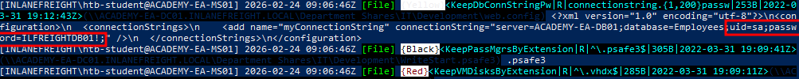

**Snaffler** is an Active Directory post-enumeration tool designed to locate **credentials, secrets, and sensitive files** stored in network shares.

It automates the discovery of high-value data by:

- Enumerating domain hosts
    
- Discovering shared folders (SMB shares)
    
- Identifying readable directories
    
- Searching for sensitive file types and keywords
    

Typical findings include:

- Password files
    
- SSH private keys
    
- Backup databases
    
- Configuration files
    
- SQL dumps
    
- Keychains and certificate material
    


---

## Requirements

Snaffler must run under one of the following contexts:

- Domain-joined Windows host
    
- Domain user session
    
- Valid domain credentials
    

Without domain authentication, enumeration will fail because SMB access depends on AD permissions.

---

## Basic Execution

Example command:

```bash
Snaffler.exe -s -d domain.local -o snaffler.log -v data
```

#### Parameters

|Option|Description|
|---|---|
|`-s`|Print results to console (stdout)|
|`-d`|Target Active Directory domain|
|`-o`|Output logfile|
|`-v`|Verbosity level|

---

## Output Interpretation

Snaffler uses **color classification**:

|Color|Meaning|
|---|---|
|Green|Accessible shares discovered|
|Black|Interesting but lower priority files|
|Red|High-value sensitive data|

Example findings:

- `.key`
    
- `.ppk`
    
- `.kdb`
    
- `.sqldump`
    
- `.mdf`
    
- `.keychain`
    
- `.psafe3`
    

These often indicate:

- Stored credentials
    
- Encryption keys
    
- Database backups
    
- Password manager exports
    
