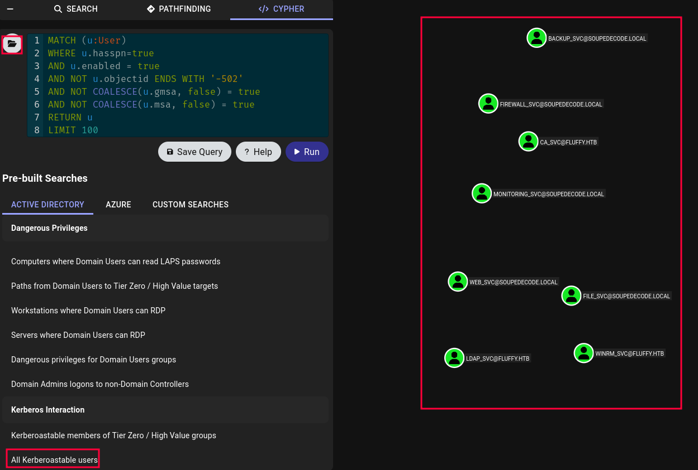

It is a method used to extract and crack service account passwords that utilize Kerberos authentication within a Windows Active Directory environment. This attack targets accounts with Kerberos Service Principal Names (SPNs) set, allowing attackers to request encrypted service tickets from the domain controller.

#### How It Works:

1. **Kerberos Authentication**:
    
    - In Active Directory, service accounts (used by services running on domain-joined machines) are assigned service principal names (SPNs). These SPNs are used to authenticate services via Kerberos.
    - When a client wants to access a service, it requests a **Ticket Granting Service (TGS)** from the **Kerberos Key Distribution Center (KDC)** for that service.
2. **TGS Request**:
    
    - The attacker identifies service accounts in the environment (typically using tools like **BloodHound** or **Kerberos enumeration**).
    - The attacker requests TGS tickets for these service accounts. This does not require any credentials, just the SPN of the service.
3. **Service Ticket**:
    
    - The KDC issues a **TGS** for the service account. This ticket is encrypted with the service account’s password hash, which the attacker cannot directly access at this point.
4. **Offline Cracking**:
    
    - The attacker extracts the TGS ticket, which contains the encrypted hash of the service account’s password.
    - The ticket can be cracked offline using tools like **Hashcat** or **John the Ripper** to obtain the plaintext password of the service account.
5. **Privilege Escalation**:
    
    - Once the attacker cracks the password, they can use it to impersonate the service account, which may have elevated privileges in the domain, granting them further access to sensitive systems or data.

#### Targeted Kerberoasting Process:

1. **Enumerate Service Accounts**:

- Find service accounts with SPNs using LDAP tools or BloodHound (SharpHound collector).



- Quick CLI alternative (Impacket) to enumerate SPN-enabled accounts:
```bash
impacket-GetUserSPNs -request -dc-ip target_ip domain_name/user
```

2. **Request TGS for Identified Service Accounts**:

- After identifying the target SPNs, you can request TGS tickets for those service accounts.

**Using Netexec (Doesn't need to enumerate SPNs previously)**
```bash
nxc ldap <ip> -u 'user' -p 'password' --kerberoasting hash.txt
```

**Using targetedKerberoast**
```bash
python targetedKerberoast.py -u <username> -p <password> -d <domain> -t <target_spn>
```

| Option    | Description |
|-----------|-------------|
| **`-u`**  | Username for authentication. |
| **`-p`**  | Password for the user. |
| **`-d`**  | Domain of the target network. |
| **`-t`**  | Target SPN (the service account you want to target). |


3. **Crack the Hash Offline**:
    
    - The encrypted hash is cracked using password-cracking tools like **Hashcat** or **John the Ripper**.
```bash
hashcat -m 13100 service-ticket.hash /usr/share/wordlists/rockyou.txt
```


