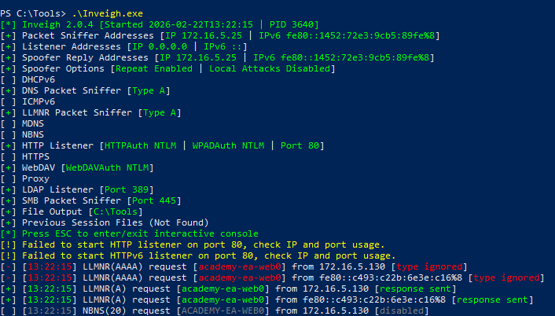

**Link‑Local Multicast Name Resolution (LLMNR)** and **NetBIOS Name Service (NBT‑NS)** are legacy Windows name‑resolution protocols designed to provide **local network hostname resolution when DNS fails or is unavailable**.

They exist mainly for compatibility and usability inside corporate networks where users frequently access shared resources using hostnames instead of IP addresses (e.g., shared folders, printers, or internal servers).

If DNS resolution fails, the system sends a request to the local network asking which device owns the requested name.

Because these requests are broadcast or multicast, **any host on the network is technically allowed to respond**, regardless of legitimacy.


---
**Responder** is a tool used to poison LLMNR, NBT-NS, and mDNS requests in order to capture NTLM authentication hashes from machines on the same local network.

It listens for broadcast name resolution requests and responds maliciously, pretending to be the requested host.

---

## Responder

**Responder** is an internal network attack tool used during penetration tests to capture Windows authentication credentials by abusing the local name‑resolution protocols.

### Basic Usage

Start Responder on the correct interface:

```bash
sudo responder -I eth0
```

Common options:

```bash
sudo responder -I eth0 -rdw
```

Flags explanation:

- `-I` → Network interface
    
- `-r` → Enable NetBIOS poisoning
    
- `-d` → Enable DHCP poisoning
    
- `-w` → Start WPAD rogue proxy server
    


### What Happens Internally

1. Victim mistypes a hostname.
    
2. Victim sends LLMNR/NBT-NS broadcast.
    
3. Responder replies claiming ownership.
    
4. Victim attempts SMB/HTTP authentication.
    
5. NTLM hash is captured.
    

### Captured Hash Location

Hashes are stored in:

```
/usr/share/responder/logs/
```

Or similar directory depending on installation.

Example captured hash:

```
USER::DOMAIN:1122334455667788:NTLM_HASH:...
```

---

## Inveigh
[Inveigh](https://github.com/Kevin-Robertson/Inveigh) is a Windows-based network spoofing and credential capture tool written in PowerShell and C#. It is designed to perform man-in-the-middle style attacks by abusing Windows name resolution protocols and authentication mechanisms.

### C# Version (Recommended)

Execute the compiled binary:

```powershell
.\Inveigh.exe
```

Startup output displays enabled modules.

Example enabled listeners:

- LLMNR packet sniffer
    
- SMB listener (port 445)
    
- HTTP listener (port 80)
    
- LDAP listener (port 389)
    

Indicators:

```
[+] Enabled
[ ] Disabled
```


#### Interactive Console
Open the interactive management console:

```
Press ESC
```

Display help menu:

```
HELP
```

View captured NTLMv2 hashes:

```
GET NTLMV2
```

Show unique hashes per user:

```
GET NTLMV2UNIQUE
```

List captured usernames:

```
GET NTLMV2USERNAMES
```

View captured cleartext credentials:

```
GET CLEARTEXT
```

Retrieve logs:

```
GET LOG
```

Stop Inveigh:

```
STOP
```

---

## Offline Password Cracking

Example Hashcat usage:

```bash
hashcat -m 5600 hashes.txt wordlist.txt
```

Mode 5600 corresponds to NTLMv2 challenge-response hashes.

---

## Detection

Detecting LLMNR/NBT‑NS poisoning involves monitoring network traffic and system events for unusual responses or authentication attempts:

1. **Network Monitoring**
    
    - Observe traffic on **UDP 5355** (LLMNR) and **UDP 137** (NBT‑NS).
        
    - Look for multiple hosts responding to the same hostname request.
        
    - Unusual ARP or multicast traffic spikes can indicate poisoning attempts.
        
2. **Event Logging**
    
    - Windows Event IDs:
        
        - **4697** – A service was installed
            
        - **7045** – A new service or script configured
            
    - Changes to **registry keys** controlling LLMNR/NBT‑NS:
        
        - `HKLM\Software\Policies\Microsoft\Windows NT\DNSClient\EnableMulticast`
            
            - `0` → LLMNR disabled
                
            - `1` → LLMNR enabled
                
3. **Active Detection Techniques**
    
    - Inject queries for non-existent hostnames and monitor responses; any reply indicates a possible attacker responding to LLMNR/NBT‑NS requests.
        
    - Use internal honeypot or monitoring hosts to detect rogue responses.
        

---

## Remediation

Mitigation focuses on **disabling unnecessary protocols** and enforcing secure authentication practices:

1. **Disable LLMNR**

- Via Group Policy:

```
Computer Configuration → Administrative Templates → Network → DNS Client → Turn off multicast name resolution
```

- Setting this to **Enabled** disables LLMNR.

2. **Disable NBT‑NS**

- Cannot be disabled via GPO directly. Must be done locally or via a startup script.

3. **Network-Level Mitigations**

- Block LLMNR (UDP 5355) and NBT‑NS (UDP 137) traffic where possible.
- Enable **SMB Signing** to prevent NTLM relay attacks.
- Use **network segmentation** to isolate systems that require legacy protocols.

