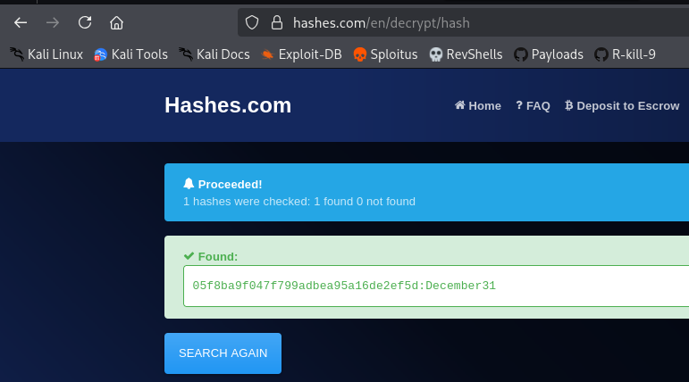

[Hashes.com](https://hashes.com/en/decrypt/hash) is an online hash lookup and decryption service that aggregates precomputed hash databases, often referred to as “hash tables” or “lookup databases”. It is commonly used in penetration testing and CTF environments as a fast way to recover plaintext values from known cryptographic hashes without performing local brute-force or dictionary attacks.

The platform works primarily as a **reverse lookup engine**: instead of computing hashes for candidate passwords, it searches whether the provided hash already exists in its indexed datasets. If a match is found, it returns the associated plaintext.

---

## Internal Matching Mechanism and Data Sources

### Hash Indexing Model

The service relies on large precomputed datasets generated from common password dictionaries, leaked credential dumps, and public wordlists. Each entry is stored as a pair:

- Hash value (e.g., NTLM, MD5, SHA1 depending on dataset)
    
- Original plaintext password
    

When a user submits a hash, the system performs a direct lookup:

```text
input_hash → database lookup → plaintext output (if exists)
```

This is fundamentally different from brute-force attacks because no hashing computation is performed during the query phase.

