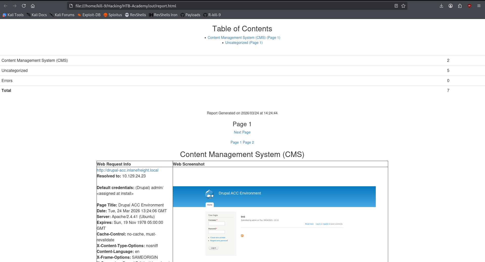
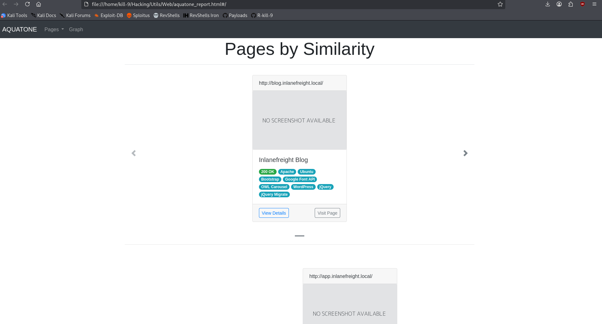

## EyeWitness

**EyeWitness** is a reconnaissance tool used to automatically capture screenshots of web applications discovered during scans. Instead of manually visiting each IP and port, the tool connects to every detected web service and generates a visual report.

It is especially useful after running tools like Nmap or Nessus, since it can directly process their XML output and identify which services are actually web applications.

In addition to screenshots, EyeWitness can also fingerprint technologies and sometimes suggest default credentials, helping to quickly prioritize interesting targets.


### Installation

```bash
# 1. Clone the repo
git clone https://github.com/FortyNorthSecurity/EyeWitness.git

# 2. Navigate to setup directory
cd EyeWitness/setup

# 3. Run the setup script (creates virtual environment)
sudo ./setup.sh

# 4. Test installation by activating virtual environment
cd ..
source eyewitness-venv/bin/activate
python Python/EyeWitness.py --single https://example.com
```


### Basic Usage

After performing a discovery scan (for example with Nmap), you can pass the XML output to EyeWitness so it processes all detected web services automatically:

```bash
eyewitness --web -x web_discovery.xml -d output_folder
```

In this command:

- `--web` tells EyeWitness to perform web screenshots using a browser (Selenium)
    
- `-x` specifies the input file (Nmap XML or Nessus)
    
- `-d` defines the directory where results will be saved
    

EyeWitness will then attempt to connect to each host and port, trying both HTTP and HTTPS when applicable.


### Result

Once finished, EyeWitness generates a report containing:

- Screenshots of each web service
    
- Basic information about each application
    

You can open the report in a browser:

```bash
firefox output_folder/report.html
```




---

## Aquatone

**Aquatone** is a tool similar to EyeWitness that is used to capture screenshots of web services. It helps automate web reconnaissance by identifying and visually documenting accessible web applications.

It can take input from a list of hosts or directly from Nmap XML output, making it very useful after discovery scans.

One key feature of Aquatone is that it not only takes screenshots, but also groups similar pages together and provides a clean HTML report, making it easier to analyze large numbers of targets.


### Installation

Aquatone is usually downloaded as a precompiled binary:

```bash
wget https://github.com/michenriksen/aquatone/releases/download/v1.7.0/aquatone_linux_amd64_1.7.0.zip
unzip aquatone_linux_amd64_1.7.0.zip
```

You can move it to a directory in your `$PATH` (e.g. `/usr/local/bin`) to run it from anywhere.


### Basic Usage

After obtaining Nmap results, you can pipe the XML output into Aquatone:

```bash
cat web_discovery.xml | ./aquatone -nmap
```

In this command:

- `-nmap` tells Aquatone to parse Nmap XML input
    
- The tool extracts web services and attempts connections on common ports
    

Aquatone will then:

- Send requests to each target
    
- Capture screenshots
    
- Record HTTP response codes
    
- Group similar pages
    

### Result

After execution, Aquatone generates:

- Screenshots of all targets
    
- An HTML report
    
- Grouped views of similar applications
    

Open the report:

```bash
firefox aquatone_report.html
```

