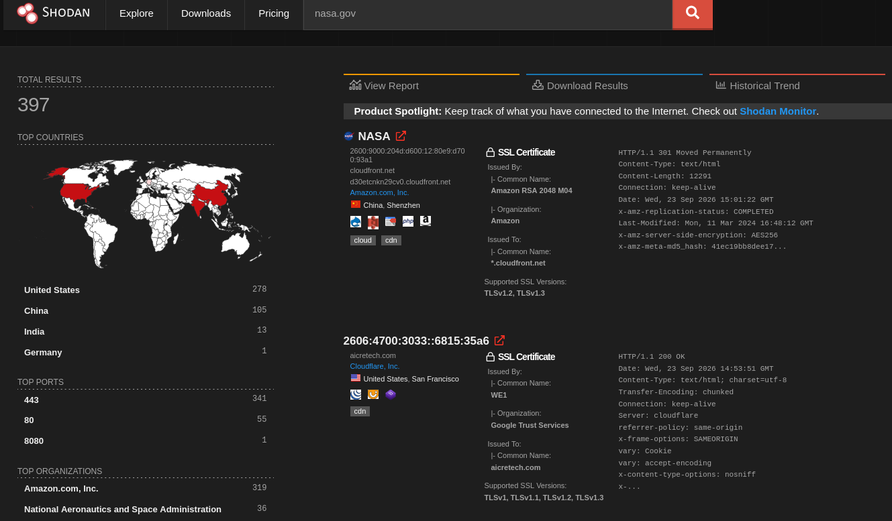
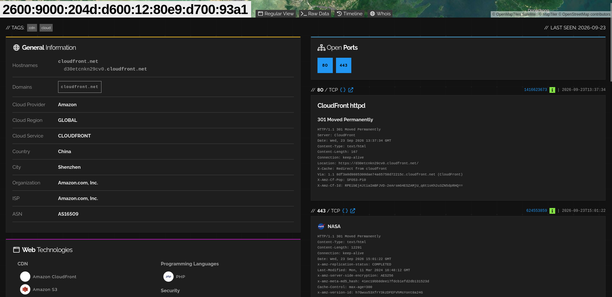
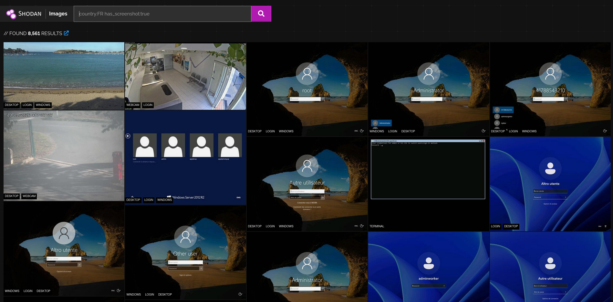

[Shodan](https://www.shodan.io/) is a search engine for Internet-connected devices and exposed services. Instead of indexing normal website content, it collects technical information such as open ports, service banners, software, versions, hostnames, certificates, technologies, and screenshots.

It is mainly useful during **external reconnaissance**, where the goal is to understand what infrastructure is publicly exposed before performing deeper enumeration.


---

## Web Search

The main Shodan search page allows you to search indexed Internet services using keywords and filters.

A generic search:



looks for `nasa.gov` across Shodan's indexed information. This can produce unrelated results because the word may appear in a banner, hostname, certificate, or other field.

For more precise searches, use filters:

```text
hostname:example.com
port:443
country:ES
org:"Example Corp"
product:"Apache httpd"
```

Filters can be combined:

```text
hostname:example.com port:443
```

This allows you to narrow the results to specific infrastructure or services.

---

## Host Information

Opening a result provides a detailed view of the host.



A host page can contain:

```text
IP address
Open ports
Detected services
Software and versions
Hostnames
Domains
Organization
Location
Operating system
SSL/TLS information
HTTP information
```

This is useful for identifying the **attack surface** associated with an exposed IP.

For example, an HTTP service may reveal:

```text
Port: 443
Product: nginx
HTTP Server: nginx
Hostname: app.example.com
```

You can then use that information for further authorized enumeration.

---

## Hostnames and Domains

Shodan can associate IP addresses with hostnames and domains discovered through its data sources.

To search for a specific hostname:

```text
hostname:example.com
```

You can also search for hosts using a domain suffix:

```text
hostname:.example.com
```

However, Shodan should not be treated as a complete subdomain enumeration tool. Tools such as `subfinder` or `amass` are better suited for discovering subdomains, while Shodan is particularly useful for determining **which discovered hosts expose services to the Internet**.

A useful workflow is:

```text
example.com
     ↓
Subdomain enumeration
     ↓
app.example.com
vpn.example.com
dev.example.com
     ↓
Shodan
     ↓
IP + ports + services + technologies
```


---

## Images

Shodan Images provides screenshots captured from certain Internet-exposed services, including RDP, VNC, RTSP, webcams, and X Windows.



A basic search is:

```text
has_screenshot:true
```

You can combine it with other filters:

```text
country:FR has_screenshot:true
```

or:

```text
port:443 has_screenshot:true
```

Screenshots can provide immediate visual information about an exposed service without interacting directly with the target.

---

## Maps

Shodan Maps displays indexed hosts geographically.

You can apply normal Shodan filters to the map, for example:

```text
country:FR port:443
```

Maps is mainly useful for **visualizing the geographic distribution of exposed infrastructure**. It uses the same underlying Shodan data rather than being a separate source of hosts.