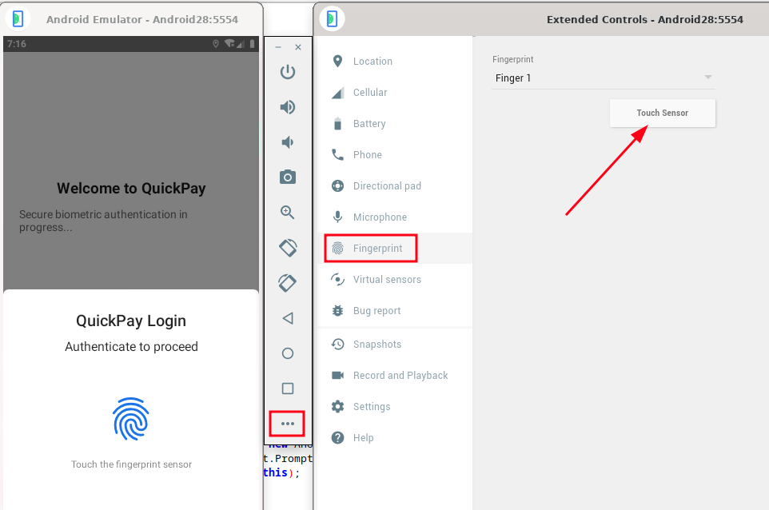
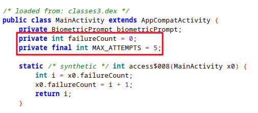
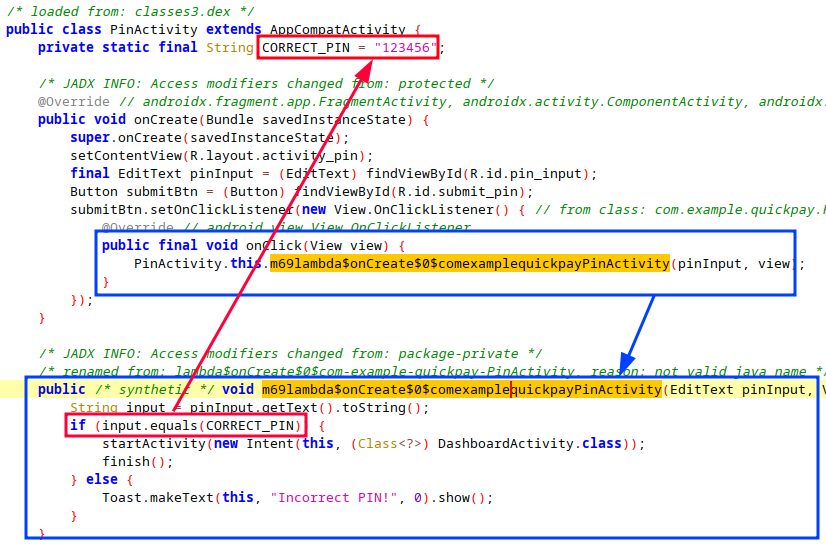

In many mobile applications, biometric authentication is used as a security mechanism to provide seamless and secure access. However, some applications implement **insecure failover mechanisms** when biometric authentication is unavailable or fails. These fallback options can introduce critical security flaws if not properly implemented.

---

### Example: Insecure Fallback to Hardcoded PIN

In this example, we have a mobile application that prompts the user to authenticate using fingerprint recognition.

**Accessing Biometric Configuration in Android Studio**

Using Android Studio’s emulator , you can test the biometric prompt by simulating biometric actions in:

```
Device Manager > Emulator > Extended Controls > Fingerprint
```



**Code Inspection: Biometric Attempt Counter**

Upon inspecting its source code, we discover a **counter** controlling the number of allowed biometric attempts. 



Once the counter reaches zero, the app redirects the user to a **PIN-based authentication screen** as a fallback.


In the fallback functionality, we found the hardcoded PIN for accessing to the application.

