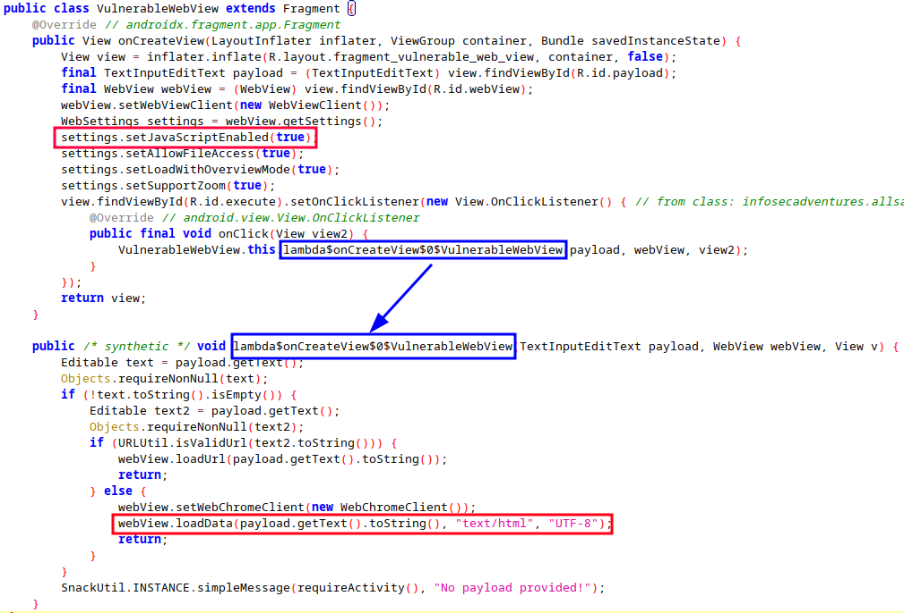

**Cross-Site Scripting** (XSS) in Android applications usually targets WebViews, particularly when they are used to load user-controlled or untrusted content without sanitization. This can allow an attacker to execute arbitrary JavaScript in the app's context.

#### Typical Scenario

XSS vulnerabilities typically arise in **hybrid apps** or apps that render dynamic content using `WebView` and call methods like `loadUrl()` or `loadData()` directly with untrusted input.


---

## Enabling JavaScript in WebView

To execute JavaScript in a `WebView`, the following method is used:
```java
WebView webView = findViewById(R.id.webview);
WebSettings settings = webView.getSettings();
settings.setJavaScriptEnabled(true);
```
This enables JavaScript execution in the embedded browser environment. Without input validation, this increases the attack surface significantly.


---

## Vulnerable Code Example
This code directly injects user input into the `WebView`, rendering it as HTML. If the input contains a `<script>` tag or inline JavaScript, it will execute inside the app.



Here you can observe how, if we input a typical XSS payload, it gets executed.

