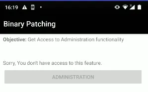
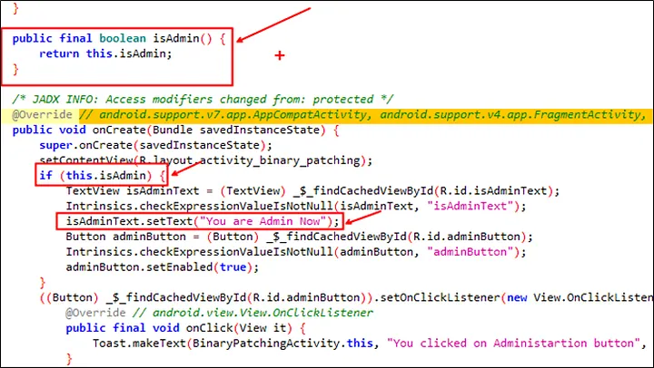

Binary patching is the process of **modifying the compiled code of an application (the binary)** to change its behavior without access to the original source code.  
In Android, this typically means decompiling an APK to its **smali** representation (Dalvik bytecode), editing the instructions, and then rebuilding the APK.


---

## Usage Example
> Example extracted from [AndroGoat](https://github.com/satishpatnayak/MyTest/blob/master/AndroGoat.apk)

In the example lab, we can access an activity called **Binary Patching**, but we cannot interact with the button because we do not have administrator privileges.



Because of this, we examined the related functionality using **Jadx**, and discovered that access depends on the `isAdmin` method.



In this case, **Frida cannot be used** to hook the method because `isAdmin` is a **Kotlin/Java `val` property** whose value is stored in a **private final field** (`isAdmin`) and simply returned by the generated getter. There is **no Java implementation code** to override—the getter is effectively compiled into a direct field read at the bytecode level. Frida can hook methods that execute code, but it cannot override direct field access or change a final field’s value at runtime without additional memory patching.

To force it to **always return `true`**, we can modify the smali code to return a constant value instead of reading the field.


#### Step-by-Step Patching

1. **Decompile the APK**  
    Use Apktool to decode the application into smali code:
```bash
apktool d owasp.sat.agoat.apk -o agoat_dec
```

2. **Locate the Target Class**  
Navigate to:
```bash
agoat_dec/smali/owasp/sat/agoat/BinaryPatchingActivity.smali
```

Find the method:
```smali
.method public final isAdmin()Z
    .locals 1
    iget-boolean v0, p0, Lowasp/sat/agoat/BinaryPatchingActivity;->isAdmin:Z
    return v0
.end method
```

| Line                                                                       | Explanation                                                                                                                                     |
| -------------------------------------------------------------------------- | ----------------------------------------------------------------------------------------------------------------------------------------------- |
| `.method public final isAdmin()Z`                                          | Declares a **public**, **final** method named `isAdmin`. The `()Z` means it takes **no arguments** (`()`) and returns a **boolean** (`Z`).      |
| `.locals 1`                                                                | Reserves one local register (`v0`) for temporary use inside the method.                                                                         |
| `iget-boolean v0, p0, Lowasp/sat/agoat/BinaryPatchingActivity;->isAdmin:Z` | Loads (`iget`) the value of the boolean field `isAdmin` from the current object (`p0`, which is `this`) and stores it into local register `v0`. |
| `return v0`                                                                | Returns the value stored in `v0` to the caller.                                                                                                 |
| `.end method`                                                              | Marks the end of the method definition.                                                                                                         |
3. **Modify the Method**  
Replace the body with:

```bash
.method public final isAdmin()Z
    .locals 1
    const/4 v0, 0x1   # 0x1 = true
    return v0
.end method
```

4. **Rebuild and Sign the APK**  
Recompile:
```bash
apktool b agoat_dec -o agoat_patched.apk
```

Sign the patched APK (Android will not install unsigned packages):
```bash
apksigner sign --ks mykey.keystore agoat_patched.apk
```

5. **Install on the Device/Emulator**
```bash
adb install -r agoat_patched.apk
```
