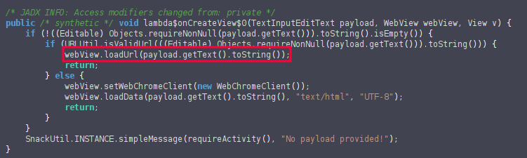
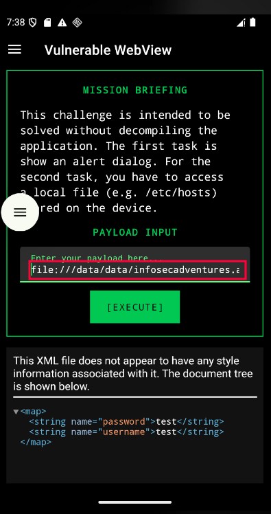
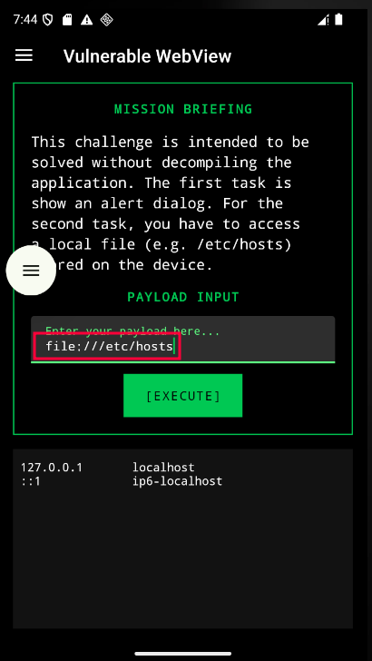

An **insecure WebView** allows web content loaded inside a mobile app to run scripts or access app resources it shouldn’t. 

---

## Attack Example
In this example taken from the Allsafe practice lab, we find an activity that implements an insecure WebView.

Analyzing the code shows the activity uses a URL provided by the user without performing any prior validation.

This allows us to inject payloads in the input such as `file:///` and internal addresses to try to access private application resources stored under `/data/data/<package>/`, for example the app’s shared preferences:

It can also be used to try to access internal files such as the hosts file:

Finally, the vulnerability can be abused to load attacker-controlled pages. For example, host an HTTP server on your attacker machine and enter its IP, port and resource path in the input to load a malicious page inside the WebView.