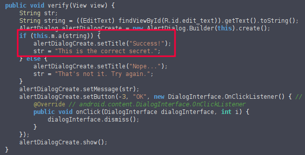
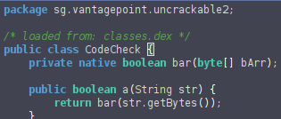
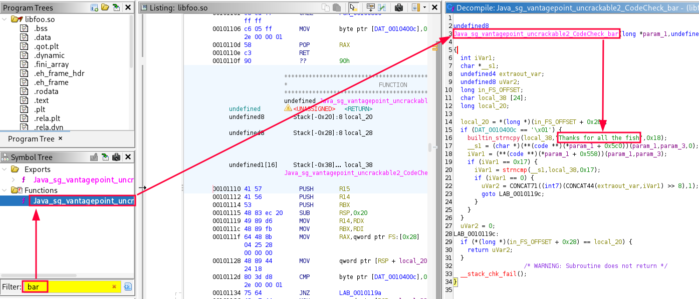

**Ghidra** is a powerful open-source reverse engineering framework ideal for dissecting Android applications at the native layer.  
While Java code inside APKs can often be decompiled with tools like JADX, many apps hide critical logic in **native libraries** (`.so` files) compiled for ARM/ARM64.  

Ghidra excels at analyzing these ELF binaries, allowing researchers to decompile functions, trace JNI calls, and uncover hidden algorithms that traditional Java-focused tools cannot reveal.


---

## Usage Example
> Example extracted from [Uncrackable Level-2](https://github.com/OWASP/mastg/tree/master/Crackmes/Android/Level_02)

During this lab we discovered that the application asks the user to enter a **secret** for verification, but the value of this secret is unknown.

To investigate, we decided to analyze the application using **jadx-gui**.

Examining **MainActivity**, we found a function called **verify** where the string entered by the user is checked by calling the method `a` of the class `m`.



A little further up in `MainActivity` we can see that the variable `m` is an instance of the class **CodeCheck**, declared as `private CodeCheck m;`.  
This led us to inspect **CodeCheck** in search of a hard-coded secret.

 

Inside the implementation of **CodeCheck** we observed that it calls a **native method** named `bar` to perform the comparison with the user-provided string.  
Because `bar` is implemented in a compiled native library (`.so`), its logic and the secret value are not visible in the Java bytecode, so **jadx** cannot reveal the hard-coded secret.

For this reason we moved to **Ghidra**:
```bash
ghidra
```

In Ghidra we created a new project and imported the APK.  

Once inside the project, we used the **Symbol Tree** filter to search for the implementation of the `bar` function identified in **CodeCheck**, which is responsible for the verification.  
Opening this native function reveals its internal logic, and inside it we can clearly see the **final hard-coded secret**.

