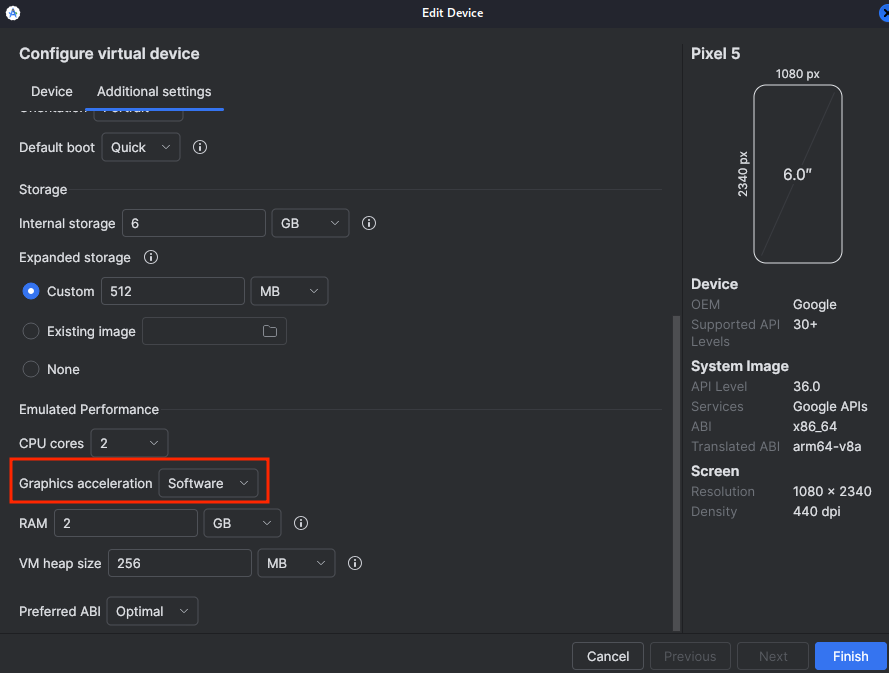

## Recommended Option: Android Emulator from Android Studio

- Official tool from Google
- Compatible with security tools like **Frida**, **Burp Suite**, **Objection**, etc.
- Allows easy rooting with custom images


---

## Step 1: Install Basic Dependencies

Open your terminal and run:
```
sudo apt update && sudo apt install -y wget unzip openjdk-17-jdk libvirt-daemon libvirt-clients bridge-utils qemu-kvm virt-manager
```

## Step 2: Download and Install Android Studio

1. Visit the official website: [Android Studio Download](https://developer.android.com/studio)
2. Download the `.zip` file for Linux.
3. Extract and run the installer:
```
sudo tar -xvzf android-studio-*-linux.tar.gz -C /opt/`\
```
The first launch may take a while. Follow the setup wizard and accept all default settings.

For executing the application use:
```bash
/opt/android-studio/bin/studio.sh
```


## Step 3: Create an Emulator (AVD)

1. Open the **AVD Manager** from Android Studio (search for it in the top-right corner).
2. Select a device (e.g., Pixel, Nexus).
3. Choose a system image (recommend using **x86_64** with **Android 10** or **11**).
4. Wait for the system image to download and then create the emulator.


---

## Step 4: Launch the Emulator

You can start the emulator from the **AVD Manager** or manually via the terminal:
```
~/Android/Sdk/emulator/emulator -avd <AVD_NAME>
```

---

## Optional: Enable Root on the Emulator

By default, official emulators have `adb root` disabled. You can enable root access with the following options:

- Option 1: Use a "Google APIs x86" image from Android 9 or earlier (where adb root typically works).

- Option 2: Download a pre-rooted image such as agisk-patched emulator images.

---

## Troubleshooting: Error 319  
If you get **Error 319** when launching the Android Emulator, it usually indicates a problem with hardware graphics acceleration on your system. 

To fix it, go to your device **Settings → Advanced Settings → Additional Settings → Emulated Performance** and change **Graphics Acceleration** to **Software**. This forces the emulator to use software rendering instead of relying on your GPU, which can prevent crashes related to incompatible or missing graphics drivers.

