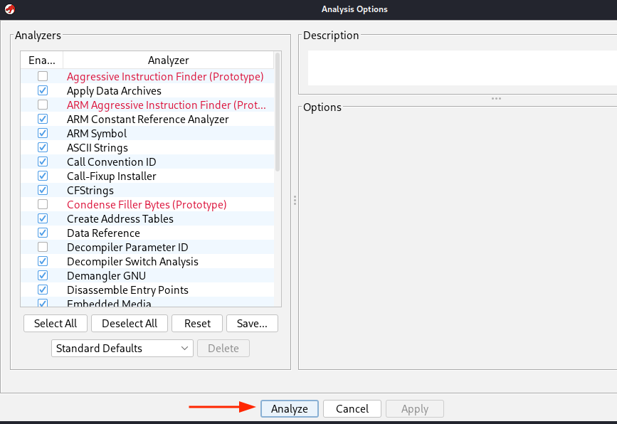

Ghidra is a powerful reverse engineering framework capable of performing deep static analysis on binaries, including those built for Google’s Android platform.  
Android applications are distributed as **APK** packages, which internally contain **DEX** bytecode (Dalvik/ART) and often native **ELF** shared libraries (`.so`).  
Because Ghidra understands both the **DEX** format and the ELF binaries for ARM/ARM64, it can be used to examine the internal structure and logic of an Android app without running it on a device.

---

## Importing into Ghidra

#### Preparing the Binary

Before starting the analysis, you need to extract the relevant binaries from the APK.

1. APK files are essentially ZIP archives, so the first step is to unpack the APK:
```bash
unzip <apk_file>.apk -d extracted_apk
```

2. Inside the extracted directory you will typically find:
    - **classes.dex**: The Dalvik/ART bytecode.
    - **lib/**: Native libraries compiled for different CPU architectures (e.g., `arm64-v8a`, `armeabi-v7a`), each containing `.so` ELF binaries.

You can analyze either the `classes.dex` (to inspect Java bytecode) or any `.so` files (to inspect native C/C++ code). Also, you can also import the `apk` file and analyze all the application. 


---

#### Executing Ghidra

After installation, Ghidra can be launched from the terminal with:
```bash
ghidra
```
When the application starts, create a **New Project**.  
Once the project is created, import a file either by selecting **File → Import File** or by dragging and dropping the file into the project window.

During the import process, a dialog will appear asking for the import mode.  
Select the **Batch** option if importing multiple files at once.


Next, Ghidra will display the **Files to Import** dialog.  
Here you can review the list of files to be imported and verify that the correct DEX or ELF binaries have been selected before proceeding.


The first popup will ask whether you want to analyze the program. Choose **Yes**, and a second dialog will appear where you can configure the analysis options.  
In most cases the default settings are appropriate, so you can simply click **Analyze** to start.



Once the Analyze button is confirmed, Ghidra will begin processing the binary and populating the disassembly and decompiler views for further examination.


---

## Application Analysis
For the analysis it can be very helpful to use the **Symbol Tree** panel located on the left side of Ghidra.  
This panel provides quick access to key elements of the binary, such as classes, methods, functions, exports, and other symbols identified during the import process.


A particularly useful feature is the **Filter** search box.  
You can type keywords that you suspect might exist in the application, such as _Root_, _CheckPin_, or other relevant terms, to quickly locate related functionality.

For example, in this case we know the app contains a method called **buttonClick**.  
Searching for “buttonClick” immediately reveals its associated code, showing both the assembly instructions and the decompiled high-level code on the right.


Additionally, when you interact with the decompiled code on the right, Ghidra automatically highlights the corresponding section of assembly code, making it easy to correlate high-level logic with low-level instructions.