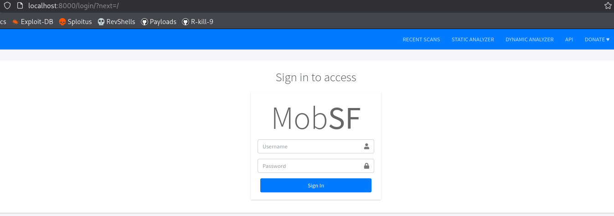
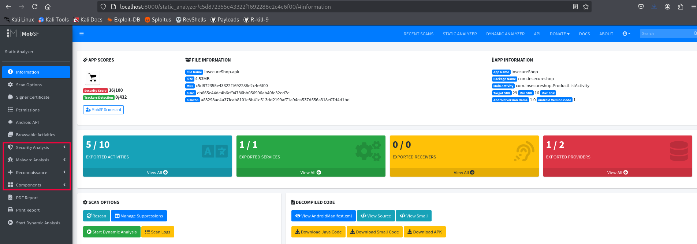

**MobSF** (Mobile Security Framework) is an automated framework for performing security analysis of mobile applications. Its **Static Analysis** feature inspects the APK (Android) or IPA (iOS) files without executing the app, uncovering potential security issues.

## Installation & Execution

#### Clone the repository
This command copies the MobSF project from GitHub to your local machine:
```bash
git clone https://github.com/MobSF/Mobile-Security-Framework-MobSF.git 
cd Mobile-Security-Framework-MobSF 
```

#### Build and Run the Docker Container

- The first time you use MoobSF, you need tobuild a Docker image named `mobsf` from the project files.
- **You only need to build the image once**, unless you make changes to the source code or Dockerfile.
```bash
sudo docker build -t mobsf .
```
- To verify that the `mobsf` image exists on your system, run:
```bash
sudo docker images
```
- After the image is created, you can start the MobSF container anytime by running:
```bash
sudo docker run -it -p 8000:8000 mobsf
```
- Finally, you can access to MobSF visiting `http://localhost:8000` in your browser.

- For the login page you will need to use the credentials `mobsf:mobsf`.

## Static Analysis with MobSF

#### Initiate the analysis
1. **Preparing the APK**
    - Ensure the APK is not obfuscated or heavily packed for better results.
    - No need for source code. MobSF decompiles the APK internally.
    
2. **Uploading the APK**
    - Open MobSF in the browser: `http://127.0.0.1:8000`
    - Drag and drop the APK file into the interface or use the upload button.
3. **Analysis Process**
    - MobSF decompiles the APK using `apktool`, `dex2jar`, and `jadx`.
    - It extracts:
        - Manifest file (AndroidManifest.xml)
        - Code structure (Java source code approximation)
        - Certificates and permissions
        - API endpoints and URLs
        - Activities, services, broadcast receivers, content providers

#### Static Analysis Reports
Cuando el analisis haya finalizado aparecera uin dashbooard resumen sobre las vulnerabilidades encontradas.



## Menu Sections Summary

#### Security Analysis

- **Network Security**  
    Analyzes network configurations such as SSL/TLS usage, HTTP vs HTTPS, and network security policies that control app communication safety.
    
- **Certificate Analysis**  
    Examines the digital certificates used to sign the app for potential issues such as weak signatures, expired certificates, or suspicious issuers.
    
- **Manifest Analysis**  
    Inspects the AndroidManifest.xml for dangerous permissions, exported components without protection, and security misconfigurations.
    
- **Code Analysis**  
    Scans the decompiled source code to find insecure coding practices, usage of risky APIs, potential injection points, or logic flaws.
    
- **Binary Analysis**  
    Reviews native binaries (.so files) for embedded vulnerabilities or suspicious patterns.
    
- **NIAP Analysis**  
    Checks compliance with NIAP (National Information Assurance Partnership) standards relevant for app security.
    
- **File Analysis**  
    Looks for embedded files that might pose a security risk or leak sensitive data.
    
- **Firebase Analysis**  
    Detects usage and configuration issues related to Firebase services which could expose user data or backend vulnerabilities.
    

---

#### Malware Analysis

- **Malware Lookup**  
    Compares app signatures and components against known malware databases to detect if the app or parts of it are flagged as malicious.
    
- **APKiD Analysis**  
    Uses APKiD to identify packers, obfuscators, and potentially malicious libraries embedded in the APK.
    
- **Behaviour Analysis**  
    Reviews static indicators of suspicious or malicious behavior encoded in the app (without running it).
    
- **Abused Permissions**  
    Flags permissions that are commonly exploited for malicious activities, helping identify overprivileged or dangerous apps.
    
- **Server Locations**  
    Provides geolocation info of servers the app communicates with, useful for spotting suspicious or risky infrastructure.
    
- **Domain Malware Check**  
    Cross-checks domains found in the app against malware or phishing blacklists.
    

---

#### Reconnaissance

- **URLs**  
    Lists all URLs and endpoints hardcoded in the app, which could reveal backend services or attack surfaces.
    
- **Emails**  
    Extracts embedded email addresses potentially used for contact, notifications, or malicious purposes.
    
- **Trackers**  
    Identifies third-party trackers embedded in the app that could compromise privacy or collect user data.
    
- **Hardcoded Secrets**  
    Finds API keys, passwords, tokens, or other sensitive secrets hardcoded within the app code.
    
- **Strings**  
    Extracts all strings from the app which can include useful or sensitive information not visible in the UI.


#### Other Important Sections

- **Components**  
    Detailed breakdown of app components:
    
    - **Activities**: UI screens.
        
    - **Services**: Background tasks.
        
    - **Receivers**: Event listeners.
        
    - **Providers**: Data sharing components.
        
    - **Libraries**: Included third-party or custom libraries.
        
    - **SBOM (Software Bill of Materials)**: List of software components and dependencies.
        
    - **Files**: All files bundled inside the app.
        
- **PDF Report & Print Report**  
    Options to export the full static analysis findings in a presentable format.