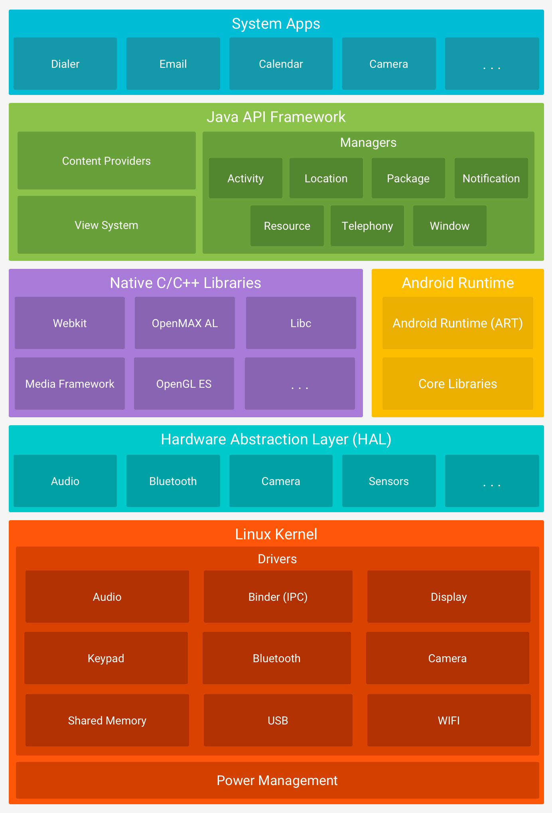

Android follows a layered architecture, but not all layers are directly exposed to attackers or researchers. Understanding **which layers are accessible** and **how data and control flow between them** is essential for identifying security boundaries and potential attack surfaces.

---

## 1. Linux Kernel

- **Access level (pentester):** Indirect, unless the device is rooted or a local privilege escalation vulnerability is available.
- **Role:** Handles low-level operations such as memory management, process scheduling, file system, networking, and hardware drivers.
- **Security relevance:**
    - Attack surface includes kernel modules, syscalls, and vendor-specific drivers (e.g., WiFi, GPU, audio).
    - Exploits include privilege escalation (e.g., Dirty COW, Binder bugs).
    - SELinux in enforcing mode adds Mandatory Access Control, but misconfigured or custom builds may weaken it.

---

## 2. Hardware Abstraction Layer (HAL)

- **Access level:** Not directly accessible from apps, unless through native execution or a privilege escalation.
- **Role:** Acts as a bridge between hardware drivers and Android’s higher-level services. OEMs provide custom HAL implementations for devices (e.g., camera, sensors, radio).
- **Security relevance:**
    
    - Bugs in custom or poorly implemented HAL modules may expose critical hardwarelevel vulnerabilities.
    - Attackers with native code execution may abuse the HAL to interact with hardware.

---

## 3. Android Runtime (ART) & Native Libraries

- **Access level:** Partially accessible.
- **Role:**
    - ART executes compiled `.dex` bytecode from Java/Kotlin apps.
    - Native libraries (C/C++) perform performance-critical or low-level tasks.
- **Security relevance:**
    - ART is a target for reverse engineering and code analysis (using tools like JADX, JEB, or smali).
    - Native libraries may expose memory corruption vulnerabilities (buffer overflows, use-after-free).
    - JNI (Java Native Interface) is a common bridge and attack surface.

---

## 4. Application Framework (API Layer)

- **Access level:** High — primary interface for app developers and the most common focus for application-layer pentests.
- **Role:**
    - Provides the official **Android APIs (Java/Kotlin)** used to build apps.
    - Exposes core services for UI, data access, telephony, location, system services, and more.
    - Implements key components: `Activity`, `Service`, `BroadcastReceiver`, and `ContentProvider`.
- **Security relevance:**
    - Major attack surface for:
        - **Component exposure** (exported or unprotected Activities, Services, etc.)
        - **Intent injection** (sending malicious Intents to components)
        - **Privilege escalation** via misused or vulnerable system APIs
        - **Insecure IPC** via Binder or AIDL interfaces
        - **Misuse of WebView**, clipboard access, or file system APIs

---

## 5. Applications (User Space)

- **Access level:** Full – this is where most pentesters operate.
- **Role:** User-installed and system apps, including the app under test.
- **Security relevance:**
    - Directly accessible for both **static** and **dynamic** analysis.
    - Entry points for testing include:
        - Decompiling APKs to inspect code logic and data handling
        - Monitoring and hooking app behavior via Frida, Objection, or Xposed
        - Intercepting IPC or Web traffic (e.g., with Burp, mitmproxy)
        - Manipulating exported components, Intent parameters, and Content URIs