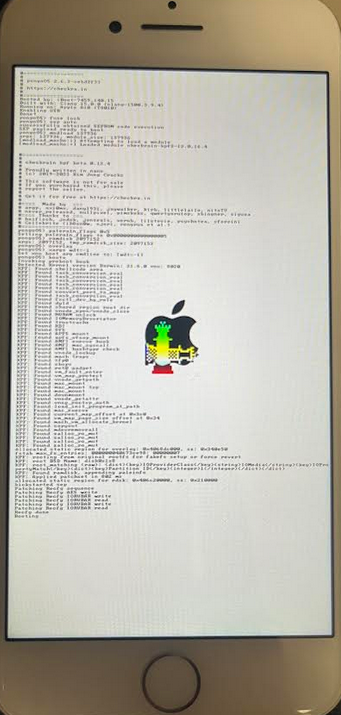

## Overview

Palera1n is compatible with all iOS devices vulnerable to the checkm8 bootrom exploit. It allows you to jailbreak almost any firmware version supported by the device. The jailbreak is **semi-tethered**, which means if the device powers off or runs out of battery, it will start normally but the jailbreak will not be active until you run palera1n again.

> [Useful Tutorial](https://www.youtube.com/watch?v=3Vd-lbaH1MM)

---

## Requirements

- A computer running **Linux** or **macOS** (Windows requires a VM or WSL with USB passthrough).
- Original or high-quality USB cable.
- **palera1n** jailbreak tool.
- Full device backup (jailbreaking always carries risk).

---

## Jailbreaking process

#### 1. Install palera1n

Open a terminal on Linux/macOS and run:
```bash
sudo /bin/sh -c "$(curl -fsSL https://static.palera.in/scripts/install.sh)"
```


#### 2. Enter DFU Mode

1. Power off the iPhone.
2. Hold **Power** for 3 seconds.
3. Without releasing Power, hold **Power + Volume Down** for 10 seconds.
4. Release Power but keep holding **Volume Down** for 5 more seconds.
5. Screen stays black → DFU mode is active.

#### 3. Run the Jailbreak
> Before executing palera1n, make sure your device is in DFU mode, because otherwise palera1n may put it into Recovery Mode and you could have trouble getting out.
- **Rootful:** Grants full system access, allowing installation of all tweaks, system modifications, and advanced tools like Frida; higher risk of system instability.
```bash
sudo palera1n -f -c
```

- **Rootless:** Restricts access to app sandboxes, limiting tweaks and system changes; safer and less likely to brick the device.
```bash
sudo palera1n -l 
```

> Try always to use Rootless method before.

|Command Option|Description|
|---|---|
|`-l`|Boots the device in **rootless mode** (safe, system files untouched).|
|`-f`|Boots in **rootful mode** using fake filesystem (full system access).|
|`-c`|**Setup fake filesystem** for rootful mode (needed for certain tweaks).|
|`-R`|Reboot the device normally.|
|`-D`|Exit after entering DFU mode.|
|`-p`|Boot into **PongoOS shell**.|
|`-P`|Boot into PongoOS shell with default images already uploaded.|
|`-s`|Boot into **safe mode**.|
|`--version`|Show palera1n version.|
|`-I`|Print info about the connected device.|
Once the **rootful** command has been executed successfully, the boot process with PongoOS will start, and the screen will display the following:



The following messages will be printed in the terminal:
```java
 - [08/15/25 01:01:20] <Info>: Waiting for DFU mode devices
 - [08/15/25 01:01:20] <Verbose>: DFU mode device found
 - [08/15/25 01:01:20] <Info>: Checking if device is ready
 - [08/15/25 01:01:20] <Verbose>: Attempting to perform checkm8 on 8010 11
 - [08/15/25 01:01:20] <Info>: Setting up the exploit
 - [08/15/25 01:01:20] <Verbose>: == checkm8 setup stage ==
 - [08/15/25 01:01:20] <Verbose>: UaF race: setup packet was accepted, attempting heuristic strategy
 - [08/15/25 01:01:20] <Verbose>: UaF race: heuristic strategy was successful
 - [08/15/25 01:01:20] <Verbose>: Entered initial checkm8 state after 1 steps
 - [08/15/25 01:01:20] <Verbose>: Stalled input endpoint after 1 steps
 - [08/15/25 01:01:20] <Verbose>: DFU mode device disconnected
 - [08/15/25 01:01:21] <Verbose>: DFU mode device found
 - [08/15/25 01:01:21] <Verbose>: == checkm8 trigger stage ==
 - [08/15/25 01:01:21] <Info>: Checkmate!
 - [08/15/25 01:01:21] <Verbose>: Device should now reconnect in download mode
 - [08/15/25 01:01:21] <Verbose>: DFU mode device disconnected
 - [08/15/25 01:01:28] <Info>: Entered download mode
 - [08/15/25 01:01:28] <Verbose>: Download mode device found
 - [08/15/25 01:01:28] <Info>: Booting PongoOS...
 - [08/15/25 01:02:30] <Info>: Found PongoOS USB Device
 - [08/15/25 01:02:32] <Info>: Booting Kernel...
 - [08/15/25 01:02:32] <Info>: Please wait up to 10 minutes for the fakefs to be created.
 - [08/15/25 01:02:32] <Info>: Once the device reboots into recovery mode, run again without the -c (Create FakeFS) option to jailbreak.
```
As the message says, we will need to wait up to 10 minutes for the **fakefs** to be created, during which the device’s screen will display the **PongoOS** interface.

After these 10 minutes have passed, we should run the command again without the `-c` flag.

```bash
sudo palera1n -f 
```

#### 4. First Boot

- Once the process finishes, the device will boot and display the **Palera1n** app.

- Ensure the device is connected to a Wi-Fi network, then use **Sileo** to install tools such as:
    - **Frida** – for runtime instrumentation
    - **OpenSSH** – for remote shell access
    - **Objection** – for mobile app security testing


- You will need to set a password in order to run certain jailbreak operations _(for example: `password`)_.


---

## Installing Tools
#### Frida
Once your iPhone has booted into the jailbroken state and you have access to **Sileo**, you can install **Frida** for runtime instrumentation.

**On the iPhone (Frida server)**

1. Open **Sileo**.
2. Go to **Sources → Edit → Add** and enter the official Frida repository:
```bash
https://build.frida.re
```
3. Install the **Frida** package from this repo.  
This will install the **frida-server** binary on your device.


**On your computer (Frida client)**

Install the Frida client on your Linux/macOS machine:
```bash
pip install frida-tools
```


#### BurpSuite
#### Step 1: Export Burp’s certificate

1. Open **Burp Suite → Proxy → Proxy Settings -> Tools → Import / Export CA Certificate**.
2. Export the certificate in **DER format (.cer)**.  
    Save it as `burp.cer`.


#### Step 2: Import on the iPhone

1. Send the `burp.cer` file to your iPhone (via AirDrop, email, or scp if you have **OpenSSH**).  
    Example with scp:
```bash
scp burp.cer root@<iphone-ip>:/var/mobile/
```
2. On the iPhone, open the `.cer` file → it will ask to install a profile → install it.

Now the cert is installed as a **user certificate** (Settings → General → VPN & Device Management → Certificates).


----


## Important Notes

- **Semi-tethered**: if you reboot the device without running palera1n, it will boot into a non-jailbroken state until you re-run the jailbreak.
- iOS 15.8.3 is supported because **checkm8** is a hardware-level exploit that cannot be patched by Apple on A10 devices.
- Avoid updating to iOS 16.x unless you verify that palera1n supports your version.