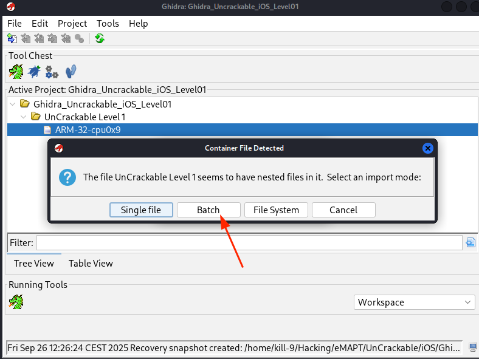
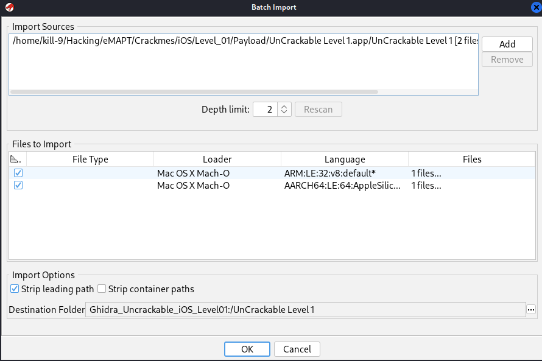
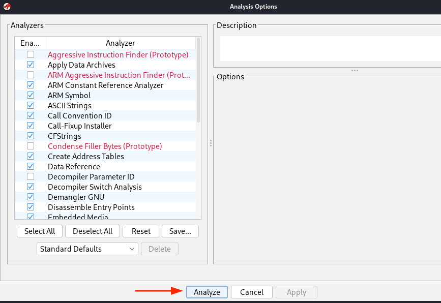

**Ghidra** is a reverse engineering framework capable of performing deep static analysis on binaries, including those built for Apple’s iOS platform. iOS applications are distributed as IPA packages, which internally contain a Mach-O executable. Because Ghidra understands the Mach-O format and supports the AArch64 instruction set used on modern iOS devices, it can be used to examine the internal structure and logic of an iOS app without running it on a device.


---

## Importing into Ghidra
#### Preparing the Binary

Before starting the analysis it is necessary to extract the actual executable from the iOS application. An IPA file is essentially a ZIP archive, so the first step is to unpack the `ipa` file. Inside the extracted directory there will be a folder called `Payload` and within it the application bundle, typically ending in `.app`.

```bash
unzip <ipa_file>
```

#### Executing Ghidra
After installation, Ghidra can be launched from the terminal with:
```bash
ghidra
```

When the application starts, create a **New Project**. Once the project is created, you need to import a file either by selecting **File → Import File** or by dragging and dropping the file into the project window.  
For iOS applications, the file to import must be the **executable Mach-O binary** that you extracted from the IPA package.

During the import process a dialog will appear asking for the import mode. Select the **Batch** option.




Next, Ghidra will display the **Files to Import** dialog. Here you can review the list of files to be imported and verify that the correct Mach-O executable has been selected before proceeding.



The first popup will ask whether you want to analyze the program. Choose **Yes**, and a second dialog will appear where you can configure the analysis options. In most cases the default settings are appropriate, so you can simply click **Analyze** to start.



Once the **Analyze** button is confirmed, Ghidra will begin processing the binary and populating the disassembly and decompiler views for further examination.


---

## Application Analysis
Para realizar e analisis puede ser muy util utilizzar el Symbol Tree situado a la izquierda. Explica brevemente que funcionalidades hay.


Algo muy util es buscar cosas en el Filterque sepas que pueden existir e la aplicación como Jailbreak, CheckPin para ver i encuentras sus fiuncionalidades relacionadas.
Por ejemplo en este ejemplo tenemos una app que sabemos que teiene un buttonClick, en este caso si buscamos el buttonClick nos aparece su codigo asociasdo en ensamblador  y el mismo codigo recontruido a al dereha


También podemos observar que si interacutamos con el código de la derecha se nos marca cual es la parte del código ensamblador relacionada.

## Example
> Example copied from [Solving crackme](https://serializethoughts.com/2019/10/28/solving-mstg-crackme-angr)

The application gives a message “Verification Failed” when a wrong input is provided to it.


On searching the binary for this string, it is found in `buttonClick` function. The message is displayed after a comparison operation using `isEqualToString`. The comparison is being performed between the input string and the value of a label marked as _hidden_.


To find the secret string, we need to find the value of this label. Further, on analysing the function `viewDidLoad`, the value of the label is being set using the return value of the function at offset `0x1000080d4`.


Shifting our attention to function at `0x1000080d4`, there are multiple sub-function calls, and return values from each of these sub-functions is stored at an index of an array at address `0x10000dbf0`. This array is the hidden string we are looking for! Each of the above sub-functions are not too complicated, but nevertheless require some manual effort to reverse them and obtain the eventual hidden string.


The function at `0x1000080d4` or any of its sub-functions are self contained, i.e, there are no library calls or system calls; we can easily run this code in any emulator like Unicorn or its likes. Angr is a reverse engineering framework with multiple features and one of them being to dynamically execute code. For using dynamic execution feature of Angr, we need to identify and pass the points in the program from where we want to emulate the code and the addresses where the eventual secret string generated. In this case, the function at `0x1000080d4` is the function we want to emulate and the return value is the information we are interested in. The return value is a pointer to the hidden string.

The eventual Angr script looks as following:

```
import angr
import claripy

def solve():

    # Load the binary by creating angr project.
    project = angr.Project('uncrackable.arm64')

    # Pass the address of the function to the callable
    func = project.factory.callable(0x1000080d4)

    # Get the return value of the function
    ptr_secret_string = claripy.backends.concrete.convert(func()).value
    print("Address of the pointer to the secret string: " + hex(ptr_secret_string))

    # Extract the value from the pointer to the secret string
    secret_string = func.result_state.mem[ptr_secret_string].string.concrete
    print(f"Secret String: {secret_string}")

solve()
```

Angr `Project` is the basic building block, and must needed to access any functionality of Angr. Using `callable` API we inform the Angr engine to execute the code from the offset `0x1000080d4`, and the return value post _concrete_ execution (dynamic execution is also called concrete execution) is captured in `ptr_secret_string`. The value stored in the pointer is accessed using `result_state`.