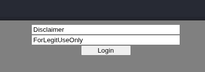
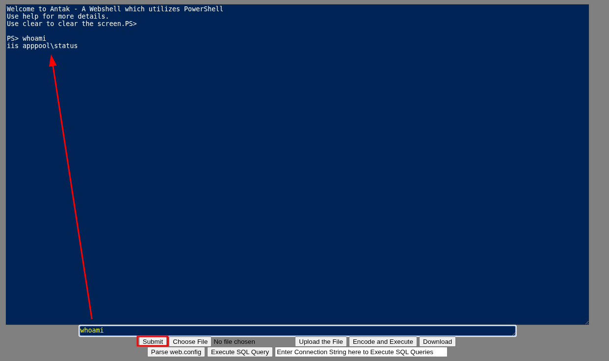

**Antak** is an ASP.NET webshell included in the **Nishang** offensive PowerShell framework. 

It leverages **PowerShell** to interact with the underlying Windows system, making it particularly effective for **Windows IIS environments**. Its interface resembles a PowerShell console, providing a familiar and powerful user experience.


---

### Functionality

Antak operates as a **PowerShell-backed webshell** and provides the following capabilities:

* Executes PowerShell commands on the target
* Runs each command as a separate process
* Executes scripts directly in memory
* Encodes commands to evade detection
* Uploads and downloads files
* Executes SQL queries
* Parses `web.config` files

Despite behaving like an interactive console, Antak does not maintain persistent PowerShell sessions.

---

### Preparing Antak for Deployment

Before uploading Antak to a target server, it is recommended to:

1. Download the file to a working directory:

```bash
wget -4 https://raw.githubusercontent.com/samratashok/nishang/refs/heads/master/Antak-WebShell/antak.aspx
```

2. Modify the hardcoded credentials inside the file:

* Set a custom **username**
* Set a strong **password**

These credentials are required to access the webshell and prevent unauthorized usage.  If you don´t  want to edit the file you can use the default credentials:
- **Disclaimer:ForLegitUseOnly**



---

## Usage

Antak is designed to be uploaded to:

* Windows servers
* IIS web applications
* Environments where ASP.NET and PowerShell are enabled

Once uploaded, navigating to the `.aspx` file will present a login prompt. Upon successful authentication, the Antak interface is loaded.

Then, in the second box you can type commands, and when you click **Submit**, you will receive the results in the first output box.



Issuing the `help` command within the interface provides a list of supported features.
