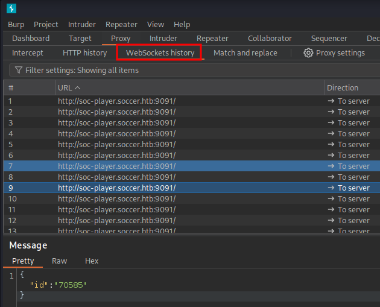

## What is a WebSocket?
**WebSocket** is a protocol that enables **full-duplex (bidirectional), persistent communication** channels over a single TCP connection. Unlike traditional HTTP requests (which are stateless and one-way), WebSockets keep the connection **open**, allowing continuous data exchange between client and server in real-time.

WebSockets can operate over the `ws://` (insecure) or `wss://` (secure) scheme, similar to HTTP/HTTPS.

---

## How WebSockets Work

1. **Handshake:**  
    Client sends an HTTP `Upgrade` request to switch from HTTP to WebSocket protocol.

2. **Connection Established:**  
    After successful handshake, both client and server can send messages anytime without closing the connection.

3. **Message Exchange:**  
    Data is sent in frames, which can be text or binary.

4. **Closing Connection:**  
    Either party can close the connection when communication ends.

---

## WebSocket Exploitation


#### 1. Find the WebSocket Endpoint

- Check browser devtools Network tab → look for `ws://` or `wss://` connections.
```bash
ws://soc-player.soccer.htb:9091
```

- Alternatively, inspect frontend JS code for `new WebSocket(...)` calls.

#### 2. Intercept & Analyze WebSocket Traffic
- Intercept the traffic by analyzing the different requests generated, checking if the requests follow a pattern similar to the four-step protocol explained earlier, where, for example, some requests include `Sec-WebSocket-Key` headers and the responses include `Sec-WebSocket-Accept` headers.
- Using **Burp Suite** with the **WebSocket** tab send test messages and observe server responses.



#### 3. Testing for Injection (SQL, NoSQL, etc.)

- Try injecting SQL, NoSQL, command injection payloads inside the message fields.    
- Example: If the message is `{"id":"123"}`, try `{"id":"123 OR 1=1"}` to test SQL Injection.
- Check if server responses change or leak information.

#### 4. Use sqlmap for Automated Testing

If you confirm the WebSocket endpoint is vulnerable to SQLi, you can use `sqlmap` to automate exploitation:

```bash
sqlmap -u "ws://soc-player.soccer.htb:9091" --data='{"id":"*"}' --risk=3 --level=5 --batch --technique=BEUSTQ --dump
```