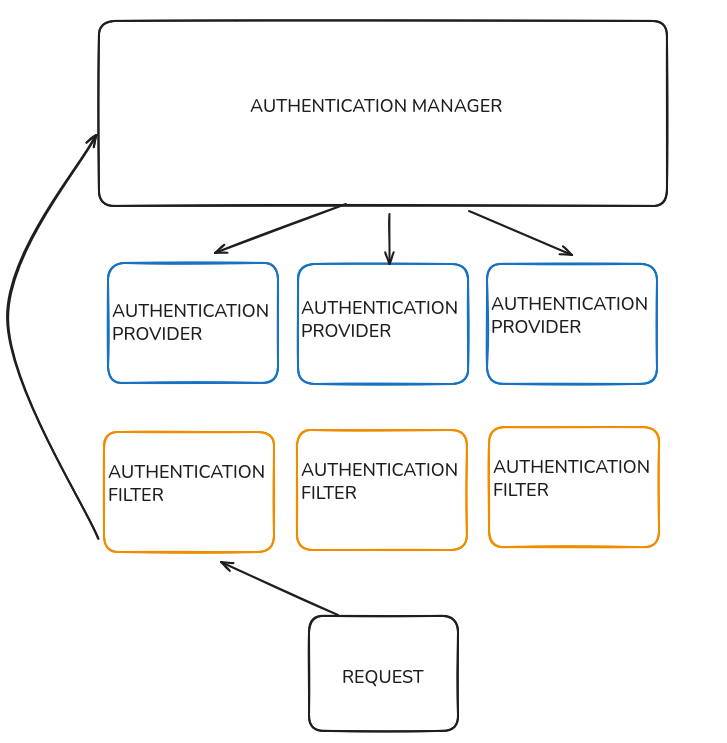

**JWT** (JSON Web Token) authentication is a stateless, token-based authentication mechanism where a signed token is issued upon successful login and used to authenticate users in subsequent requests. In Spring Security, this is implemented using a combination of filters, authentication managers, and providers.

---
## Flow Overview

1. A **Request** arrives with a JWT in the header.
    
2. The **Authentication Filter** intercepts it.
    
3. It builds an **Authentication** object and passes it to the **Authentication Manager**.
    
4. The **Authentication Manager** delegates to a suitable **Authentication Provider**.
    
5. If authentication is successful, the security context is populated.
    
6. The request proceeds through the filter chain.


---

## Components Explained

#### Authentication Filter

This component intercepts incoming requests and extracts the JWT.

```java
public class JwtAuthenticationFilter extends OncePerRequestFilter {
    @Override
    protected void doFilterInternal(HttpServletRequest request, HttpServletResponse response, FilterChain filterChain)
            throws ServletException, IOException {
        
        String token = extractJwtFromHeader(request);

        if (token != null && isValid(token)) {
            UsernamePasswordAuthenticationToken auth = getAuthentication(token);
            SecurityContextHolder.getContext().setAuthentication(auth);
        }

        filterChain.doFilter(request, response);
    }
}
```

- **Responsibility:** Extract token, validate structure/signature.
    
- **Chain position:** One of potentially many authentication filters.


---

#### Authentication Manager

This orchestrates the authentication process by passing the token to available providers.

```java
public class CustomAuthenticationManager implements AuthenticationManager {
    private final List<AuthenticationProvider> providers;

    @Override
    public Authentication authenticate(Authentication authentication) throws AuthenticationException {
        for (AuthenticationProvider provider : providers) {
            if (provider.supports(authentication.getClass())) {
                return provider.authenticate(authentication);
            }
        }
        throw new BadCredentialsException("No valid provider found");
    }
}
```

- **Responsibility:** Delegates to appropriate provider.
    
- **Pluggable:** Can support multiple providers (e.g., JWT, DB, LDAP).


---

#### Authentication Provider

Handles the actual validation of the JWT and user lookup.

```java
public class JwtAuthenticationProvider implements AuthenticationProvider {
    private final JwtService jwtService;

    @Override
    public Authentication authenticate(Authentication authentication) throws AuthenticationException {
        String token = (String) authentication.getCredentials();
        String username = jwtService.extractUsername(token);

        if (!jwtService.isTokenValid(token, username)) {
            throw new BadCredentialsException("Invalid token");
        }

        UserDetails user = loadUserByUsername(username);
        return new UsernamePasswordAuthenticationToken(user, token, user.getAuthorities());
    }

    @Override
    public boolean supports(Class<?> authentication) {
        return UsernamePasswordAuthenticationToken.class.isAssignableFrom(authentication);
    }
}
```


---

## Example Request Flow

```java
Client → [Request with JWT] → JwtAuthenticationFilter
        → creates UsernamePasswordAuthenticationToken
        → passes to AuthenticationManager
        → JwtAuthenticationProvider validates JWT
        → returns authenticated Authentication object
        → SecurityContextHolder is updated
        → FilterChain continues → Controller
```