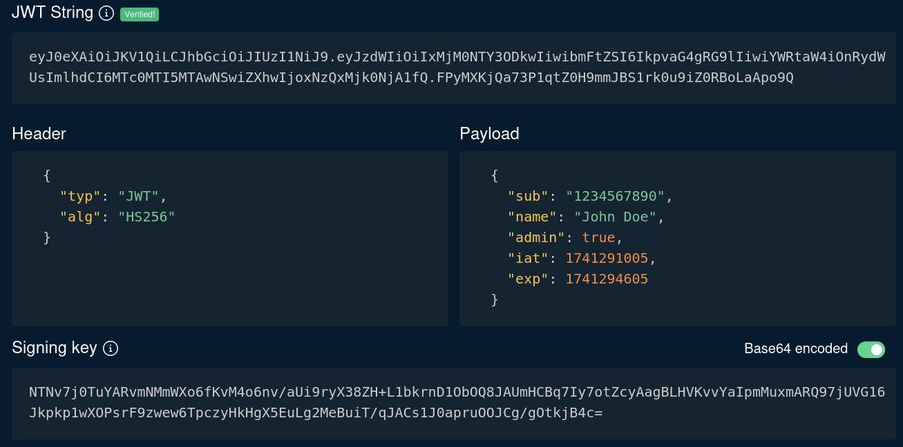

JWT token forgery occurs when an attacker manipulates or forges a JWT to impersonate a legitimate user or escalate privileges.

## JWT Manipulation
[token.dev](https://token.dev) is a useful tool for inspecting and manipulating JWTs. It helps you understand the three main components of a token:

- **Header:** Contains metadata, including the algorithm used for signing.

- **Payload:** Holds the claims or data, like user roles or expiration times.

- **Signature:** Verifies the token’s integrity and authenticity.

This page can be used to modify token parameters and test how servers handle changes, helping to spot signature validation flaws or misconfigurations.

## Common Vulnerabilities Leading to JWT Forgery

- **Improper Token Validation:** If the token signature is not correctly verified, the values of the JWT can be modified. This could be used, for example, for changing the `role` parameter of the JWT from `user` to `admin` and grant access with elevated privileges.

- **Weak Secret Keys:** JWT tokens are signed with a secret key. Weak or easily guessable keys can allow attackers to brute force the key and sign their own tokens.

- **None Algorithm Vulnerability:** JWT supports different algorithms (e.g., HS256, RS256). If the server accepts the "none" algorithm, attackers can create unsigned tokens.

- **Algorithm Confusion (RS256 to HS256 Downgrade Attack):** If the server mistakenly allows switching between asymmetric (RS256) and symmetric (HS256) algorithms, attackers can forge tokens by using the public key as a secret key.

- **Expired Tokens Not Properly Handled:** If the server doesn’t verify token expiration, attackers can use old tokens indefinitely.

