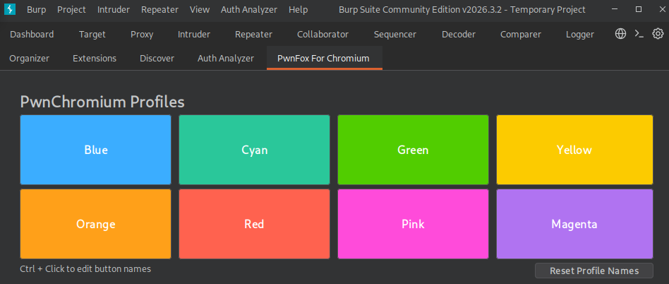
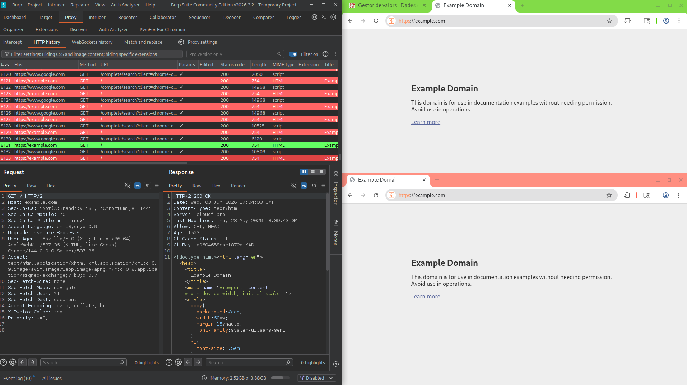

## PwnFox
**PwnFox** is a browser extension commonly used during web application assessments. It adds visual indicators and custom headers to requests, making it easier to identify traffic originating from different browser profiles.

While originally developed for Firefox, Chromium-compatible versions are also available.

### Installation
Open the Burp Suite BApp Store and search for **PwnFox for Chromium**.

After installation, a new tab will appear inside Burp Suite where browsers can be launched.


### Multi-User Testing

One of the main advantages of PwnFox is simplifying multi-user testing.

A common scenario is testing with:

- Administrator account
    
- Standard user account
    
- Guest account
    

Each browser profile can use a different color:

```http
X-PwnFox-Color: green
```

```http
X-PwnFox-Color: red
```

```http
X-PwnFox-Color: blue
```

Inside Burp Suite, requests become instantly identifiable, avoiding confusion when multiple sessions are active simultaneously.



---

## Auth Analyzer
**Auth Analyzer** is a Burp Suite extension designed to verify whether authentication and authorization controls are correctly enforced by the target application. It automates the process of replaying requests using different authentication contexts and comparing the responses.

This is especially useful when testing for authorization issues such as IDORs, missing access controls, or privilege escalation vulnerabilities.

### Installation

Open the Burp Suite BApp Store and search for **Auth Analyzer**.

After installation, a new tab will appear inside Burp Suite where authentication profiles and comparison rules can be configured.

### Authentication Profiles

The extension works by creating multiple authentication contexts. Typically, one profile represents a low-privileged user and another represents a higher-privileged account.

For example:

```http
Cookie: session=user1_session
```

```http
Cookie: session=admin_session
```

When a request is intercepted, Auth Analyzer automatically replays it using the configured profiles and compares the responses.

### Detecting Authorization Issues

Consider the following request:

```http
GET /api/users/123 HTTP/1.1
Host: target.local
Cookie: session=user1_session
```

The extension may replay the same request using another session:

```http
GET /api/users/123 HTTP/1.1
Host: target.local
Cookie: session=user2_session
```

If both responses contain the same sensitive information, the endpoint may be vulnerable to horizontal privilege escalation.


