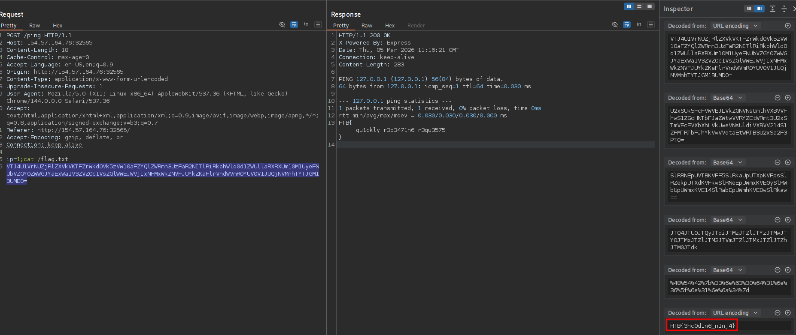

**Burp Suite** is an intercepting proxy used during web application security testing to analyze, manipulate, and replay HTTP/S traffic between a client and a target application. It operates by positioning itself between the browser and the server, allowing the tester to observe every request and response in real time. By configuring the browser to use Burp as a proxy (typically `127.0.0.1:8080`), all web traffic can be captured and inspected. This enables testers to understand application behavior, identify parameters, and modify requests to test authentication, authorization, input validation, and other security controls.

---
## Interceptor
The **Proxy Interceptor** is the component responsible for capturing HTTP requests and responses as they pass through the proxy. When interception is enabled, Burp pauses the request before it reaches the server, allowing the tester to inspect and modify it. This is useful for manipulating parameters, changing headers, or altering request methods before forwarding them to the target application.

Example workflow:

```
Proxy → Intercept → Intercept is ON
```

Captured request:

```
POST /login HTTP/1.1
Host: target.com
Content-Type: application/x-www-form-urlencoded

username=admin&password=test
```

A tester might modify it before forwarding:

```
username=admin'--&password=test
```

This allows testing for vulnerabilities such as SQL injection or authentication bypass.

---

## HTTP History
The **HTTP History** panel records all HTTP requests and responses that pass through the proxy, regardless of whether interception is enabled. This acts as a passive traffic log where testers can review previous interactions with the application. It is especially useful during reconnaissance of a web application because it provides visibility into endpoints, parameters, cookies, and response codes.

For example, HTTP History may reveal hidden API endpoints such as:

```
GET /api/v1/users
POST /api/v1/updateProfile
GET /admin/config
```

This allows testers to identify potential attack surfaces that may not be visible in the UI.

---

## Repeater
The **Repeater** tool is designed for manually modifying and resending HTTP requests multiple times. A request from HTTP History or the Proxy can be sent to Repeater with `Ctrl + R`. Once in Repeater, the tester can repeatedly modify parameters and send requests to observe how the server responds. This is commonly used for testing injection vulnerabilities, authentication logic, or input validation.

Example of a request sent to Repeater:

```
POST /api/login HTTP/1.1
Host: target.com
Content-Type: application/json

{"username":"admin","password":"password"}
```

A tester might test different payloads:

```
{"username":"admin","password":"' OR 1=1--"}
```

or attempt parameter manipulation:

```
{"username":"admin","password":"password","role":"admin"}
```

Since Repeater allows quick iteration, it is ideal for manual exploitation and debugging server behavior.

---

## Inspector
The **Inspector** panel provides a structured view of the HTTP request and response components. Instead of manually parsing raw HTTP messages, the Inspector separates elements such as headers, parameters, cookies, JSON bodies, and query strings. This makes it easier to identify editable fields and understand how the request is constructed.

For example, within the Inspector a tester can quickly locate:

- Query parameters
    
- Form parameters
    
- JSON body fields
    
- Cookies
    
- Authentication headers
    

It also provides a very useful decode functionality, that performs multiple decoding operations of the selected value:
